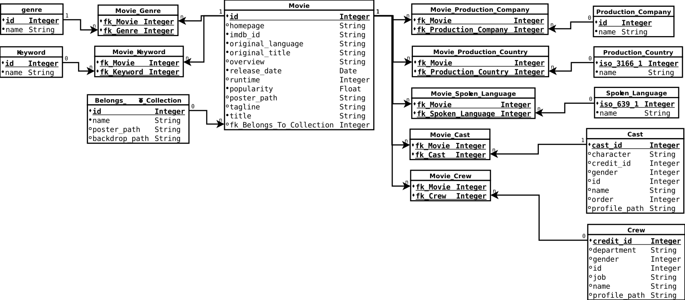
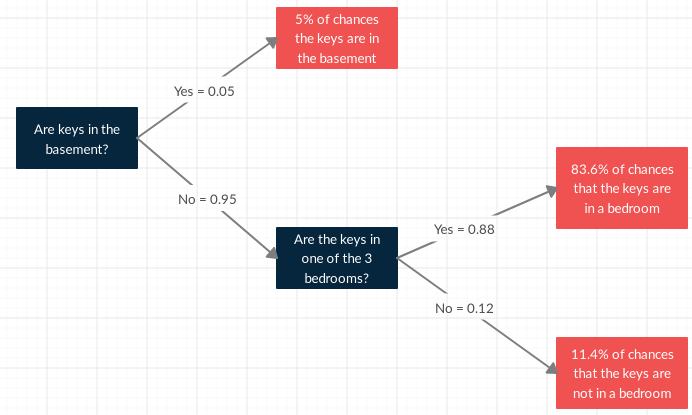

# Business Overview

## Context
In a world... where movies made an estimated $41.7 billion in 2018, the film industry is more popular than ever. For some movies, it's "You had me at 'Hello.'" For others, the trailer falls short of expectations and you think "What we have here is a failure to communicate."

## Problem
With metadata on over 7,000 past films from [The Movie Database](https://www.themoviedb.org/), we have to predict their overall worldwide box office revenue.

## Objective
The objective is to determine:

- What movies make the most money at the box office?
- How much does a director matter?
- How much does the budget matter?

We have to determine the movie revenue (\$) in function of the budget (\$) and in function of if the movie had a director as a member of the crew when they made it. Then, we have to identify let's say a top 10 in descending order of the predicted movie revenues.


# Dataset Information
The train and test datasets come from the Kaggle competition [TMDB Box Office Prediction](https://www.kaggle.com/c/tmdb-box-office-prediction/data). The objective is to know from the train dataset:

- The column names
- The number of columns
- The number of rows
- The number of values that are `NA` and empty 

Knowing this information gives hints on how to analyse the data and how the features could be correlated. If there are any NA or empty values, we have to understand the meaning of NA and empty in their context. This holds also for budgets of 0$.

## General Information
```{r echo = FALSE, message = FALSE, warning = FALSE, comment=NA}
source("Source/DatasetInformation.R")
source("Source/DataPreparation.R")
source("Source/DataTransformation.R")

library(ggplot2)
library(gridExtra)
library(dplyr)
library(stringr)
library(lubridate)
library(tictoc)
library(corrplot)

train <- read.csv("Dataset/train.csv", 
                  header = TRUE, 
                  stringsAsFactors = FALSE,
                  row.names="id")

test <- read.csv("Dataset/test.csv", 
                  header = TRUE, 
                  stringsAsFactors = FALSE,
                  row.names="id")

set.seed(1234)

## Remove scientific notation (e.g. E-005).
options(scipen = 999)

## Set the title of all charts in the middle.
theme_update(plot.title = element_text(hjust = 0.5))

PrintDatasetInformation(train)
PrintDatasetInformation(test)

## Global variables
train.length <- nrow(train)
test.length <- nrow(test)
all_data.length <- train.length + test.length
```

Here is the relational model of the dataset that is described in more details in sub-sections below.
```{r pressure, echo=FALSE, out.width = '100%'}

```


## Possible Algorithms
We know that the objective is to predict the revenue of every movie in the test dataset. We also know that:

- The output is the revenue of every movie.
- The output is a real number.
- The accuracy of the prediction is important over the speed (which should not be neglected)

Therefore, we need algorithms in the supervised learning and regression category. In this analysis, we consider the following models considering that the speed has to be taken in consideration:

- Linear regression
- Random Forest
- Extreme Gradient Boosting Trees


## Code Book

### Movie Collection Information
The feature `Belongs_to_collection` contains the following properties as a JSON array:

- id: The movie collection ID (Integer)
- name: The movie collection name (string)
- poster_path: The movie collection poster image path(string)
- backdrop_path: The movie collection backdrop path (string)

The value of this feature is empty if the movie is not in a collection (e.g.The movie collection Back to the future 1, 2, and 3). We deduce that:

- A movie is in its own collection if and only if the feature `belongs_to_collection` is empty. 
- A movie cannot be in more than one collection.
- A collection may contain many movies.

### Movie Genres Information
The feature `genres` contains the following properties as a JSON array:

- id: The genre ID (integer)
- name: The name of the genre

According to the dataset, we deduced that:

- A movie can have one or many genres.
- A genre can contain one or many movies.
- A movie can have no genre meaning that it is not classified.

### Production Companies Information
The feature `production_companies` contains the following properties as a JSON array:

- iso_3166_1: The production company country abbreviation (e.g. US)
- name: The production company name

According to the dataset, we deduced that:

- A movie can be produced by one or many companies.
- A production company can have produced one or many movies.
- A movie that is not associated to at least one production company could be produced by amators or particular producer producing his own movies.

### Production Countries Information
The feature `production_countries` contains the following properties as a JSON array:

- iso_3166_1: The production country abbreviation (e.g. US) where the movie has been produced
- name: The production country name

According to the dataset, we deduced that:

- A movie can be produced in one or many countries.
- A production country can contain one or many movies.
- A movie that is not associated to at least one production country could be ???

### Spoken Languages Information
The feature `spoken_languages` contains the following properties as a JSON array:

- iso_639_1: The spoken language country abbreviation (e.g. US)
- name: The spoken language name (could contain non ascii characters)

According to the dataset, we deduced that:

- In a movie, one or many languages can be spoken.
- A spoken language can be used in one or many movies.
- A movie that is not associated to at least one spoken language could be silent movies like Charlie Chaplin or Mr. Bean.

### Keywords Information
The feature `Keywords` contains the following properties as a JSON array:

- id: The keyword ID (Integer)
- name: The keyword (String)

According to the dataset, we deduced that:

- One or many keywords can be used for a movie.
- One or many movies can be associated to a keyword.
- A movie that is not associated to at least one keyword could be ???.

### Cast Information
The feature `cast` contains the following properties as a JSON array:

- cast_id: The cast ID corresponding to one character playing in the movie.
- character: The character name in the movie (could be empty)
- credit_id: The credit ID as an hexadecimal string
- gender: The character is a female (1), a male (2) or other (0)
- id: The ID of the actor playing in the movie or of an event occuring in the movie
- name: The name of the actor playing in the movie or of the event occuring in the movie
- order: The order of displaying in the credit at the end of the movie
- profile_path: Avatar of the actor of the movie as an image path

Note that an actor can play in one or many movies and a cast can contain one or many actors.

### Crew Information
The feature `crew` contains the following properties as a JSON array:

- credit_id: The credit ID as an hexadecimal string representing a member of the crew
- department: Department name in which the member of the crew was working (e.g. Directing, Writing, Sound, etc.)
- gender: The member of the crew is a female (1), a male (2) or other (0)
- id: The ID of the member of the crew
- job: The job name of the member of the crew (e.g. Director, Producer, Writer, Screenplay, etc.)
- name: Name of the member of the crew
- profile_path: Profile image path of the member of the crew

Note that a member of the crew can be hired to help making one or many movies and a movie can contain one or many members of the crew.


# Data Preparation
The objective of preparing the data is to clean the dataset and make the dataset workable in order to visualize the data. Preparing the dataset is represented by the following steps:

1. Detect and fix values that seem to be wrong in their context.
2. Replace the NA or empty values in the dataset by meaningful values.
3. Determine and remove columns that will not help us on the visualisation of data.
4. Add new features from existing ones.

## JSON Standard Validation
The objective is to detect features that contain invalid keys and/or values and fix them with valid values without modifying the context of the data.

If we take a closer look to the JSON strings, we notice that their keys and values of type string are all surrounded by single quotes. Here is an example taken from the first observation of the feature `belongs_to_collection`:
`[{'id': 313576, 'name': 'Hot Tub Time Machine Collection', 'poster_path': '/iEhb00TGPucF0b4joM1ieyY026U.jpg', 'backdrop_path': '/noeTVcgpBiD48fDjFVic1Vz7ope.jpg'}]`.
This is not respecting the [JSON standard](https://www.json.org/) which requires double quotes for string values. The library `jsonlite` is validating this standard and we get a validation error. In order to fix that, we have to replace all single quotes in all JSON strings of the dataset by double quotes. However, we have to assume that there may have single or double quotes in the string value itself. 

Here is a list of syntax rules that we verify:

1. All keys have to be surrounded by double quotes `"` followed by a colon `:`, a space and its mapped value (e.g. `"id": 1`).
2. All string values have to be surrounded by double quotes `"` (e.g. `"string value"`).
3. Special characters like double quotes ("), backslashes `\` and squares `#` must not be used.
4. The value `None` (e.g. `"backdrop_path": None`), `[]`, `N/A` or empty must not be used as a value. The value `null` has to be used instead.
5. Each element of an array has to start with a bracket `{` followed by a double quote `"` (e.g. `{"id"`).
6. Each element of an array has to end with a bracket `}` (e.g. `"name": "Comedy"}`).
7. Each mapping (key, value) has to be separated by a comma `,` (e.g. `"id": 18, "name": "Drama"` or `"name": null, "id": 2` or `"name": "US", "id": 1`).

For example, there are some actors having a nickname in their character name in the cast. Those are written between double quotes (e.g. in the cast of Rocky Balboa: `'cast_id': 17, 'character': 'Adrianna "Adrian" Pennino'`). Because of such a case, we have to replace all double quotes by single quotes on first step.

```{r echo = FALSE, message = FALSE, warning = FALSE, comment=NA}
## The feature Keywords is the only one whose name is starting with an uppercase.
## To be coherent with all of the other feature names, it has to start with a lowercase.
colnames(train)[which(names(train) == "Keywords")] <- "keywords"
colnames(test)[which(names(test) == "Keywords")] <- "keywords"

features_to_fix <- c("belongs_to_collection", "genres", "production_companies", "production_countries", "spoken_languages", "keywords", "cast", "crew")
for(feature_to_fix in features_to_fix)
{
    train[, feature_to_fix] <- FixJSONStandardErrors(train[, feature_to_fix])
    test[, feature_to_fix] <- FixJSONStandardErrors(test[, feature_to_fix])
}
```


## Incorrect Values 
An incorrect value is a value that is invalid in the feature context. For example, the feature `crew` having an observation that gives the keywords instead or the crew. It can be seen as a misplaced value. We also validate the coherence between observations of a same feature. It could occur that for the feature `genres` that all observations except one start with the `id` whereas one of them starts with `name` instead. This is an incoherence between this observation and the others.

Since there are too many error possibilities, we establish the following rules for every observation in every feature containing JSON strings:

- The JSON string in the feature `belongs_to_collection` has to start with the property `id` like `[{"id":` *or* be empty.
- The JSON string in the feature `genres` has to start with the property `id` like `[{"id":` *or* be empty.
- The JSON string in the feature `production_companies` has to start with the property `name` like `[{"name":` *or* be empty.
- The JSON string in the feature `production_countries` has to start with the property `iso_3166_1` like `[{"iso_3166_1":` *or* be empty.
- The JSON string in the feature `spoken_languages` has to start with the property `iso_639_1` like `[{"iso_639_1":` *or* be empty.
- The JSON string in the feature `keywords` has to start with the property `id` like `[{"id":` *or* be empty.
- The JSON string in the feature `cast` has to start with the property `cast_id` like `[{"cast_id":` *or* be empty.
- The JSON string in the feature `crew` has to start with the property `credit_id` like `[{"credit_id":` *or* be empty.

```{r echo = FALSE, message = FALSE, warning = FALSE, comment=NA}
features_to_validate <- list(belongs_to_collection = "id",
                             genres = "id",
                             production_companies = "name", 
                             production_countries = "iso_3166_1", 
                             spoken_languages = "iso_639_1", 
                             keywords = "id", 
                             cast = "cast_id", 
                             crew = "credit_id")

PrintNumberOfInvalidValuesDetected(train, features_to_validate)
PrintNumberOfInvalidValuesDetected(test, features_to_validate)
```


## NA Values
The only feature containing `NA` in the train dataset is the movie runtime (6 movies among 7398). We consider the value `0` the same as the `NA` value because having a movie runtime of 0 minutes is impossible. We get the 2 movies from the train dataset where their runtime is `NA` and then we replace their value by a valid one taken from another source (e.g. IMDB).

```{r echo = TRUE, message = FALSE, warning = FALSE, comment=NA}
knitr::kable(train[is.na(train$runtime), c("title", "release_date", "runtime")])

## Source: https://www.imdb.com/title/tt1107828/
train[1336, "runtime"] <- 130

## Source: https://www.german-films.de/filmarchive/browse-archive/view/detail/film/happy-weekend/index.html
train[2303, "runtime"] <- 94

knitr::kable(test[is.na(test$runtime), c("title", "release_date", "runtime")])

## Source: https://www.imdb.com/title/tt0082131/ 
test[244, "runtime"] <- 93

## Source: https://www.imdb.com/title/tt3132094/ 
test[1490, "runtime"] <- 91

## Source: https://www.filmaffinity.com/es/film267495.html 
test[1633, "runtime"] <- 100

## Source: https://www.imdb.com/title/tt2192844/ 
test[3818, "runtime"] <- 90
```


##Empty Values
Many of the features having at least one empty value are explained the following ways:

- `belongs_to_collection`: The movie does not belong to a collection of movies.
- `homepage`: The movie does not have a homapage.
- `poster_path`: The movie does not have a film poster. We assume that either the movie has a very low budget and get low revenue or they do not have this information or oversight the poster when inserting the movie in the database.
- `overview`: The movie does not have an overview. We assume that the movie is not enough popular to take the time to give an overview of the movie or it could be an oversight.
- `spoken_languages`: The movie could be a silent movie like Charlie Chaplin or Mr. Bean.
- `production_companies`: A movie self-made could be the reason why a movie does not use a production company.
- `tagline`: The does not have a tagline. We assume that a movie with a great tagline is a movie that we remember. We expect that the movie popularity will be higher. Movie without taglines are less popular and then the revenue could be lower.
- `Keywords`: No keywords describe the movie. 
- `genres`: We assume that a movie not associated to genres is non classifed. 
- `title`: The empty movie title could be an oversight because the original title is taken instead in some rare cases.

We assume that the empty values in the following features are oversights in the database or they just do not have the information on them:

- `production_countries`: It is impossible that a movie is produced nowhere. It could be possible that there is no information found about the production country.
- `crew`: It is impossible that a movie has been made by itself. It has to have at least one member of the crew like the producer.
- `status`: There are 7396 / 7398 movies that are relased. The 2 other movies do not have a status. In this case, we assume that they are released.
- `release_date`: There are 7397 / 7398 movies that have a release date. 

We have to replace this empty date by a real date because we extract parts of the date in the data visualisation and transformation section. [From the IMDB source](https://www.imdb.com/title/tt0210130/) the empty release date is replaced by the following one:
```{r echo = TRUE, message = FALSE, warning = FALSE, comment=NA}
test$release_date[test$release_date == ""] <- "5/1/00"
```


## Zero Values
Some movies budget are 0 in both datasets and need to be replaced by a significative value. In such a case, we use the median which gives better results for the train dataset than the mean. We are not using a linear regression model because the budget depends on many variables such as the popularity, the number of members in the crew, the number of characters in the casting, the production company and surely others that we do not have in our dataset. 

```{r echo = FALSE, message = FALSE, warning = FALSE, comment=NA}
cat("There are", length(train$budget[train$budget == 0]), "movies with 0 of budget. \n\n")

train.budget.median <- median(train$budget[train$budget > 0])
test.budget.median <- median(test$budget[test$budget > 0])
train$budget[train$budget == 0] <- train.budget.median
test$budget[test$budget == 0] <- test.budget.median

cat("The median of non-zero budgets in the train set is:", train.budget.median, "\n")
cat("The median of non-zero budgets in the test set is:", test.budget.median, "\n\n")
```


## Useless Features
The objective is to remove features that will not be useful for the prediction. It could be features where movies are all in the same category except few movies. It could also be unique values like IDs without `NA` or empty values.

The first one is the movie `status` because it seems that all movies in both dataset are released except only few of them that are not released. 

```{r echo = FALSE, message = FALSE, warning = FALSE, comment=NA}
knitr::kable(train %>%
  group_by(status) %>%
  summarise(number_of_movies = n()))

knitr::kable(test %>%
  group_by(status) %>%
  summarise(number_of_movies = n()))

train$status <- NULL
test$status <- NULL
```

The `imdb_id` and `poster_path` are also useless because they have unique values. Then, we cannot classify them and get insights on the revenue based on them.

```{r echo = FALSE, message = FALSE, warning = FALSE, comment=NA}
train$imdb_id <- NULL
train$poster_path <- NULL

test$imdb_id <- NULL
test$poster_path <- NULL
```

Since there are only 8 movies having no overview in the dataset, it is useless to see what is the revenue in function of if the movie has or not an overview. The same logic applies to the `original_title` and `title` features.

```{r echo = FALSE, message = FALSE, warning = FALSE, comment=NA}
train$overview <- NULL
train$original_title <- NULL

test$overview <- NULL
test$original_title <- NULL
```

Since we want to know which production companies have made the best movies revenue, it becomes usaless to keep the production countries.

```{r echo = FALSE, message = FALSE, warning = FALSE, comment=NA}
train$production_countries <- NULL
test$production_countries <- NULL
```

We keep the `title` only for the next section for informational purposes. It will be removed at the end of the next section.


# Data Visualization and Transformation
The first objective is to verify if we reject or not our assumptions by visualizing the data using scatter plots or bar charts. This will help us to know which features are helpful or useless on the predictions.

The second objective is to transform the train dataset in order to obtain a matrix of real and integer values for the predictions purposes. Each time the conclusion according to their chart will show that the feature has a significant impact on the revenue, the string (including the ones containing JSON) feature is transformed to a numeric feature. Otherwise we remove the feature.


## Movie Revenues {#MovieRevenues}
Let's get a general picture on the revenue values and verify if the values are normally distributed.

```{r echo = FALSE, message = FALSE, warning = FALSE, comment=NA}
summary(train$revenue)

train.ordered_revenue <- train %>%
  select(title, release_date, revenue) %>%
  arrange(desc(revenue))

knitr::kable(head(train.ordered_revenue, n = 10))
knitr::kable(tail(train.ordered_revenue, n = 10))
```

There is a huge gap between the mean and the median implying that the revenue is skewed. We also note that the movie `All at Once` generated 3\$ of revenue on the Box-Office. According to IMDB, the movie generated 3 514 780\$ worldwide. Another example is the indian movie `Saamy` which generated 3\$ of revenue. Again, according to IMDB, the movie generated 510 000 000 indian rupees gross (world) which correspond to 7 406 475 US dollars today (according to the exchange rate, the revenue seems to correspond to around 11 million dollars in 2003). The following questions would need to be answered:

1. Are there incorrect revenues?
2. Are some revenues expressed in million of US dollars?
3. Are all revenues converted in US dollars?
4. Are all revenues converted in function of the money exchange rate when the dataset has been built or when the movie has been released?

Answers to these questions would be very useful to know how to convert them and then get much better predictions. At least knowing money devise would have helped.

Let's see now how the revenue distribution behaves in order to know if the revenue is skewed or not. If so, we will adjust it with the logarithm.

```{r echo = FALSE, message = FALSE, warning = FALSE, comment=NA}
ggplot(train, aes(x = revenue)) +
    geom_histogram(colour = "blue", fill = "white") +
    ggtitle("Distribution of the revenues")
```

We see that the revenue is highly skewed to the left. Let's see how the log distribution of the revenue behaves:

```{r echo = FALSE, message = FALSE, warning = FALSE, comment=NA}
ggplot(train, aes(x = log(revenue + 1))) +
    geom_histogram(colour = "black", fill = "white") +
    ggtitle("Distribution of the log-revenues")
```

The log distribution reduced significantly the skewness of the revenue, hence we keep the log revenue instead. 


## Movie Collection
The objective is to know if the income of a movie belonging in a collection is higher than a movie that is not in a collection. A movie that belongs in a collection could mean that:

- the movie was enough good to gain a large revenue that the producer(s) decided to make a second movie and so on as a series.
- the same or another producer decided to do a remake of the movie many years after the original one (e.g. Karate kid, Superman).

For both assumptions, we expect a greater revenue for movies in a collection.

```{r echo = FALSE, message = FALSE, warning = FALSE, comment=NA}
train$is_in_collection <- unlist(lapply(train$belongs_to_collection, HasTheFeature))
train$belongs_to_collection <- NULL

test$is_in_collection <- unlist(lapply(test$belongs_to_collection, HasTheFeature))
test$belongs_to_collection <- NULL
```

We build a bar chart to represent the average log-revenue in function of if the movie is in a collection or not.

```{r echo = FALSE, message = FALSE, warning = FALSE, comment=NA}
local({
    train.collection <- Dataset.GroupByFeature(train, "is_in_collection")
    
    plot.revenue <- ggplot(train.collection, aes(x = factor(is_in_collection), y = mean_revenue)) +
        geom_bar(stat = "identity") + 
        ggtitle("Average revenue in\n function of if the movie is in\n a collection or not") +
        labs(x = "In a collection", y = "Average Revenue") + 
        scale_x_discrete(labels = c("No", "Yes"))
    
    collections <- data.frame(is_in_collection = c(train$is_in_collection, test$is_in_collection),
                              dataset = c(rep("train", train.length), rep("test", test.length)))
    
    plot.movies <- ggplot(collections, aes(x = factor(is_in_collection), fill = dataset)) +
        geom_bar(position = "dodge") + 
        geom_text(aes(label = scales::percent(..count.. / sum(..count..))),
                  stat = "count",
                  position = position_dodge(width = 1),
                  size = 3.5) +

        ggtitle("Number of movies that are\n in a collection or not") +
        labs(x = "In a collection", y = "Number of Movies") + 
        scale_x_discrete(labels = c("No", "Yes"))
    
    grid.arrange(plot.revenue, plot.movies, ncol = 2)
})
```

The percentage on the bar chart means the percentage of movies among the test and train sets combined. The difference between movies in a collection and the ones not in a collection is considerable. We see that 20% (which represent `r round(all_data.length * 0.2, 0)` movies) of the movies are in a collection adding to the fact that the difference is considerable.


## Movie Keywords
From the feature `keywords`, we only need to know the number of keywords used in order to facilitate the search of the movie. We assume that a movie associated to many keywords could help increasing its revenue because it is easier to search and find. However, if there are too many keywords, the precision of the search will be lower because the number of movies associated with all of these keywords will increase instead. It depends also on the precision of the keywords. For example, the movie `Casino Royale` keywords `James Bond`, `007`, `Digit` and `casino` are more precise than `bank`, `money` and `terrorist`.

```{r echo = FALSE, message = FALSE, warning = FALSE, comment=NA}
train$number_of_keywords <- unlist(lapply(train$keywords, CountJSONArrayInFeature))
train$keywords <- NULL

test$number_of_keywords <- unlist(lapply(test$keywords, CountJSONArrayInFeature))
test$keywords <- NULL
```

We build a scatter plot to represent the average log-revenue in function of the number of keywords.

```{r echo = FALSE, message = FALSE, warning = FALSE, comment=NA}
local({
    keywords <- Dataset.GroupByFeature(train, "number_of_keywords")
    
    ggplot(keywords, aes(x = number_of_keywords, y = mean_revenue)) +
        geom_point() + 
        geom_vline(xintercept = 14, colour = "red", linetype = "dashed") +
        geom_vline(xintercept = 33, colour = "red", linetype = "dashed") +
        ggtitle("Average revenue in function of the number of keywords") +
        labs(x = "Number of Keywords", y = "Average Revenue") 
})
```

Having keywords helps on the movie revenue but having no keywords or too many of them have a negative impact. According to the scatter plot, movies with greatest revenues are located between 14 and 34 keywords. Outside of this range, the revenues are lower.

For example, if a model is based on a decision tree (as a weak learner), a random data point $(x, y)$ would be in one of the following regions in $\mathbb{N} \times \mathbb{R}$ (where $x$ is the number of keywords and $y$ the revenue):

- $\{0,1,\ldots, 13\} \times \mathbb{R}$
- $\{14, 15, \ldots, 33\} \times \mathbb{R}$
- $\{34, 35, \ldots\} \times \mathbb{R}$

where we expect, for a given random number of keywords $x$, that $\mathbb{P}(14 \leq x \leq 33) < \mathbb{P}(x \leq 13)$ and $\mathbb{P}(14 \leq x \leq 33) > \mathbb{P}(x \geq 34)$. In other terms, we expect that movies with less than 14 keywords are the most probable in the dataset. Let's calculate the probability for each region:

- The probability that $x \leq 13$ is `r nrow(train[train$number_of_keywords <= 13, ]) / train.length`.
- The probability that $14 \leq x \leq 33$ is `r nrow(train[train$number_of_keywords >= 14 & train$number_of_keywords <= 33, ]) / train.length`.
- The probability that $x \geq 180$ is `r nrow(train[train$number_of_keywords >= 34, ]) / train.length`.


## Members of the Crew
From the feature `crew`, we want to know if having a director as a member of the crew has significant impacts on the movie revenue. The director has the role to choose the cast and crew members (make generally the decisions), they have to be creative in order to ensure the movie is realized within the budget. However, the director depends on the budget to make the movie and also on his competences.

```{r echo = FALSE, message = FALSE, warning = FALSE, comment=NA}
train$number_of_directors <- unlist(lapply(train$crew, CountCrewMembersByJobType, job.type = "Director"))
test$number_of_directors <- unlist(lapply(test$crew, CountCrewMembersByJobType, job.type = "Director"))
```

We build a bar chart in order to represent the average revenue in function of the number of directors.

```{r echo = FALSE, message = FALSE, warning = FALSE, comment=NA}
directors <- Dataset.GroupByFeature(train, "number_of_directors")
local({
    ggplot(directors, aes(x = number_of_directors, y = mean_revenue)) +
        geom_bar(stat = "identity") + 
        ggtitle("Average revenue in function of the number of directors") +
        labs(x = "Number of Directors", y = "Average Revenue") 
    
    knitr::kable(directors)
})
```

According to this bar chart, the difference between crew having at least a director and crew having no directors is not significant except for 5 and more directors. However, without knowing the number of movies per number of directors, we cannot know the reasons behind this.

```{r echo = FALSE, message = FALSE, warning = FALSE, comment=NA}
train$number_of_directors <- NULL
test$number_of_directors <- NULL
```

We see that only `r directors$number_of_movies[directors$number_of_directors == 0]` movies with crews having no directors have been made compared to the others having at least a director. Is this an enough large sample to conclude that the revenue will be much better if the crew has no director, since it represents only `r round(directors$number_of_movies[directors$number_of_directors == 0] / train.length * 100, 2)`% of the movies in the train dataset? On a mathematical point of view, the sample is not enough large to conclude but on a data driven point of view, those movies show that having or not directors in the crew does not matter. Furthermore, most of movies (`r round(directors$number_of_movies[directors$number_of_directors == 1] / train.length * 100, 2)`% of them) have been made with one director in the crew.

We also expect that a director will not be alone in the crew members. Some of the members have certainly written the movie script in order to be produced. The producer has the role to select the script and ensure the schedule and budget are respected. In order to improve the sequences of a movie and make the movie in its finished state, an editor is important. In summary, we assume that the number of members in the crew has an impact on the revenue. We expect that a small crew will make low revenue movies whereas a large crew will make bigger revenue movies.

```{r echo = TRUE, message = FALSE, warning = FALSE, comment=NA}
directors <- NULL
train$number_of_crew_members <- unlist(lapply(train$crew, CountJSONArrayInFeature))
#train$crew <- NULL

test$number_of_crew_members <- unlist(lapply(test$crew, CountJSONArrayInFeature))
#test$crew <- NULL
```

We build a bar chart in order to represent the average revenue in function of the number of crew members.

```{r echo = FALSE, message = FALSE, warning = FALSE, comment=NA}
local({
    crew_members <- Dataset.GroupByFeature(train, "number_of_crew_members")
    
    plot.log_revenue <- ggplot(crew_members, aes(x = number_of_crew_members, y = mean_log_revenue)) +
              geom_point() + 
              geom_smooth() + 
              ggtitle("Average log-revenue in function\n of number of crew members") +
              labs(x = "Number of Crew Members", y = "Average Log-Revenue")
    
    plot.revenue <- ggplot(crew_members, aes(x = number_of_crew_members, y = mean_revenue)) +
              geom_point() + 
              geom_smooth() + 
              ggtitle("Average revenue in\n function of the number\n of crew members") +
              labs(x = "Number of Crew Members", y = "Average Revenue") 
    
    grid.arrange(plot.log_revenue, plot.revenue, ncol = 2)
})
```

We show also the scatter plot of the average log-revenue in function of the number of members in the crew because it is more explicit that the revenue increases as the number of members increases until around 125 members.


## Crew Departments
A movie generally needs a large crew depending on the complexity of the special effects, the quality of the movie, costumes and so on. Thus, there are many teams where each of them works on their speciality. Examples of departments can be Production for producers, Art for set decorations and production designers, etc. 

We want to know if departments have a correlation with the revenue and which ones are the most useful to generate greatest revenues.

```{r echo = FALSE, message = FALSE, warning = FALSE, comment=NA}
local({
    crew.departments <- Crew.GroupByDepartment(train)
    
    print(ggplot(crew.departments, aes(x = department, y = mean_revenue)) +
        geom_bar(stat = "identity") + 
        ggtitle("Average revenue in function of the crew department") +
        labs(x = "Crew Department", y = "Average Revenue") +
        theme(axis.text.x = element_text(angle = 90, hjust = 1, vjust = 0.5)))
    
    print(ggplot(crew.departments, aes(x = department, y = number_of_members)) +
        geom_bar(stat = "identity") +
        ggtitle("Number of crew members per department") +
        labs(x = "Crew Department", y = "Number of Crew Members") +
        theme(axis.text.x = element_text(angle = 90, hjust = 1, vjust = 0.5)))
})

train$crew <- NULL
test$crew <- NULL
```

Taking the mean revenue and the number of movies in consideration, `Crew`, `Art` and `Visual Effects` departments have the greatest ratio. Worst departments are `Directing` and `Writing`.


## Movie Casting
For the feature `cast`, we know that more characters are playing in a movie, more large must be the budget. This is also based on the popularity of the actors and how much money they ask to play in the movie. We assume that most of the time, the revenue is increasing as the number of actors increases.

```{r echo = FALSE, message = FALSE, warning = FALSE, comment=NA}
train$number_of_characters <- unlist(lapply(train$cast, CountJSONArrayInFeature))
train$cast <- NULL

test$number_of_characters <- unlist(lapply(test$cast, CountJSONArrayInFeature))
test$cast <- NULL
```

We build a scatter plot to represent the average log-revenue in function of the number of characters playing in the movie.

```{r echo = FALSE, message = FALSE, warning = FALSE, comment=NA}
local({
    characters <- Dataset.GroupByFeature(train, "number_of_characters")
    
    print(ggplot(characters, aes(x = number_of_characters, y = mean_log_revenue)) +
              geom_point(aes(colour = "Data Points")) + 
              geom_smooth() +
              stat_function(fun = function(x) 10 + 2 * log(x), aes(colour = "Fit Function")) + 
              ggtitle("Average log-revenue in function of number of characters") +
              labs(x = "Number of Characters", y = "Average Log-Revenue"))
    
    print(ggplot(characters, aes(x = number_of_characters, y = mean_revenue)) +
              geom_point() + 
              geom_smooth() +
              ggtitle("Average revenue in function of the number of characters") +
              labs(x = "Number of Characters", y = "Average Revenue"))
})
```

We have to consider the budget allowed because it is possible that many actors play in a low budget movie. These actors are paid with a lower salary or they are inexperienced which could justify their low salary. Another reason could be that many of these actors are playing a very short amount of time in the movie. This may explain why sometimes with many characters the revenue is still low. However, the curve $$f(x) = 2\ln(x) + 10$$ fits well with the data points and could be used to model them on the average log-revenue scatter plot. However, it does not mean that this model will fit well with the test data points.


## Popular Actors
An actor having the first role in a movie is selected generally because he is a great actors and gain popularity from people. An actor is popular when he is the main actors in many movies and in an entire collection of movies. For example, in comedies, Adam Sandler is very popular especially in Happy Gilmore, Billy Madison, Fifty first dates and so on. 

Assuming that the main actor is given as the first one in the list of casting in the dataset, we expect that more a main actor have played in movies, better the revenue is. Therefore, we want to obtain the list of main actors with the number of movies in which they played.


## Movie Genres {#genres}
Nowadays, superheros movies (like Avengers, Superman, Iron man, etc.), action/adventure and animation movies are really popular and their incomes are generally big. These movies are classified as science-fiction, action, animation, adventure and fantasy. We assume that those genres of movies generate more revenues than the others. 
We know that a movie can be classified in one or many genres. However, we cannot assume that the genres in the train set will all be in the test set and vice-versa. Because of that, we cannot base our results on the average revenue, since the revenue does not exist in the test set. Therefore, we will have to estimate it. Knowing that, the first objective is to visualize how the revenue and the number of movies vary in function of the genre. This objective is split in 3 steps:

1. Calculate the average revenue for every genre in the train set.
2. Show a bar chart of the average revenue per genre.
3. Show the number of movies per genre for the train and test sets.

```{r echo = FALSE, message = FALSE, warning = FALSE, comment=NA}
## Step 1: Calculate the average revenue for every genre in the train set.
train.movies.genres <- AppendExtractedData(train, "genres", subfeatures.to_exclude = "id")
movies.genres.names <- Dataset.GroupByFeature(train.movies.genres, "name")
movies.genres.names$id <- seq(1, nrow(movies.genres.names))

## Step 2: Show a bar chart of the average revenue per genre.
print(ggplot(movies.genres.names, aes(x = name, y = mean_revenue)) +
          geom_bar(stat = "identity") + 
          ggtitle("Average revenue in function of the genre") +
          labs(x = "Genre", y = "Average Revenue") + 
          theme(axis.text.x = element_text(angle = 90, hjust = 1, vjust = 0.5)))

## Step 3: Show the number of movies per genre for the train and test sets.
test.movies.genres <- AppendExtractedData(test, "genres", subfeatures.to_exclude = "id")
genres <- data.frame(name = c(train.movies.genres$name, test.movies.genres$name),
                     dataset = c(rep("train", nrow(train.movies.genres)), rep("test", nrow(test.movies.genres))))

print(ggplot(genres, aes(x = name, fill = dataset)) +
          geom_bar(position = "dodge") +
          geom_text(aes(label = scales::percent(..count.. / sum(..count..))),
                    stat = "count",
                    position = position_dodge(width = 1),
                    size = 1.8) +
          ggtitle("Number of movies for each genre of the train and test sets") +
          labs(x = "Genre", y = "Number of Movies") +
          theme(axis.text.x = element_text(angle = 90, hjust = 1, vjust = 0.5)))
```

According to the average revenue bar chart, it shows that the `Foreign` and `Documentary` genres generated the lowest average revenues with a significant difference compared to the others. However, the genre `TV Movie`seems to be a general genre (TV and film genres) maybe because they cannot classify the movies. According to the number of movies bar chart, we see that there are only few movies classified `TV Movie` making the average revenue not meaningful. Because of that, the number of movies has to be considered in order to get a better balance with the average revenue.

As we know, the revenue feature does not exist in the test set. In order to be consistent, we use an estimator of the revenue to know which genre has the best average revenue. The second objective is to keep the genre having the best estimated average revenue per movie. This objective is split in the following steps:

1. Define a scoring function estimating the weighted average revenue for each genre in the dataset.
2. Find features that have a strong correlation with the revenue.
3. Define a linear regression equation estimating the revenue.
4. Calculate the score for each genre for the train and test sets.
5. Show a bar plot of the genre in function of their score for the train and test sets.
6. Extract and set the genre with the best score for each movie.

We define the score function as the weighted estimated average revenue of a genre where the weight is the number of movies classified under a genre. In other terms, we have:
$$
\begin{aligned}
    G_i(\hat{y}_i) &= \left(\frac{1}{k_i} \sum_{j = 1}^{k_i} \hat{y}_{i,j}\right) \frac{k_i}{n_m} \\
                   &= \frac{1}{n_m} \sum_{j = 1}^{k_i} \hat{y}_{i,j}
\end{aligned}
$$
where: 

- $k_i$ is the number of movies classified under the genre $i$
- $\hat{y}_{i,j}$ is the estimated revenue of the movie $j$ in the genre $i$
- $n_m$ is the number of movies in the dataset. 

The estimation of the revenue is based on the budget because we know that the correlation between the revenue and the budget is strong ([see Linear Regression Model](#LinearRegressionModel) section). We use the Pearson correlation test to find the correlation coefficient between the budget and the revenue. The correlation coefficient is defined by
$$
r(x, y) = \frac{\sum_{i = 1}^{n_m} (x_i - \bar{x})(y_i - \bar{y})}{\sqrt{\sum_{i = 1}^{n_m} (x_i - \bar{x})^2 \sum_{i = 1}^{n_m}(y_i - \bar{y})^2}}
$$
where:

- $x$ is the budget vector of the train set
- $y$ is the revenue vector
- $\bar{x}$ is the average budget
- $\bar{y}$ is the average revenue

```{r echo = FALSE, message = FALSE, warning = FALSE, comment=NA}
## Step 2: Find features that have a strong correlation with the revenue.
x <- train$budget
x.mean <- mean(x)
y <- train$revenue
y.mean <- mean(y)

r <- sum((x - x.mean) * (y - y.mean)) / sqrt(sum((x - x.mean)*(x - x.mean)) * sum((y - y.mean)*(y - y.mean)))
cat("Pearson Correlation Coefficient:", r, "\n\n")

print(cor.test(train$budget, train$revenue, method = "pearson"))
```

The Pearson correlation test shows that our assumption holds, since the p-value is less than $0.05$ and then rejecting the null hypothesis that $r(x, y) = 0$. Note that $t$ is given by the formula
$$
t = \frac{r\sqrt{n_m - 2}}{\sqrt{1 - r^2}}.
$$
In order to get the p-value $p$, we have to calculate the probability $\mathbb{P}(T > t)$ using the Student's t-distribution where $T \sim t(n_m - 2)$. Using a confidence level of 95% with the t-distribution table and a degree of freedom of `r train.length - 2`, we obtain $T = 1.96$.

We estimate the revenue in function of the budget $x$ with the linear regression equation defined as
$$
\hat{y} = \beta_0 + \beta_1 x
$$
where we have to find the coefficients $\beta_0, \beta_1 \in \mathbb{R}$.

```{r echo = FALSE, message = FALSE, warning = FALSE, comment=NA}
## Step 3: Define a linear regression equation estimating the revenue.
budget.fit <- lm(formula = train$revenue ~ train$budget)
summary(budget.fit)
budget.fit.coefficients <- coef(budget.fit)
```

We found that $\beta_0$ is `r budget.fit.coefficients["(Intercept)"]` and $\beta_1$ is `r budget.fit.coefficients["train$budget"]`. Substituting in $G_i(\hat{y}_i)$ we obtain the scoring function
$$
\begin{aligned}
  G_i(x_i) &= \frac{1}{n_m} \sum_{j = 1}^{k_i} (\beta_0 + \beta_1 x_{i,j}) \\
           &= \frac{k_i \beta_0 + \beta_1 \sum_{j = 1}^{k_i} x_{i,j}}{n_m}.
\end{aligned}
$$

```{r echo = FALSE, message = FALSE, warning = FALSE, comment=NA}
## Step 4: Calculate the score for each genre for the train and test sets.
train.genres.with_score <- CalculateScoresOfFeature(train.movies.genres, budget.fit.coefficients, train.length)
train.genres.with_score$id <- seq(1, nrow(train.genres.with_score))

test.genres.with_score <- CalculateScoresOfFeature(test.movies.genres, budget.fit.coefficients, test.length)
test.genres.with_score$id <- seq(1, nrow(test.genres.with_score))

## Step 5: Show a bar plot of the genre in function of their score for the train and test sets.
knitr::kable(train.genres.with_score)
genres <- data.frame(name = c(train.genres.with_score$name, test.genres.with_score$name),
                     score = c(train.genres.with_score$score, test.genres.with_score$score),
                     dataset = c(rep("train", nrow(train.genres.with_score)), rep("test", nrow(test.genres.with_score))))

print(ggplot(genres, aes(x = name, y = score, fill = dataset)) +
          geom_bar(stat = "identity", position = "dodge") +
          ggtitle("Score for each genre in the train and test sets") +
          labs(x = "Genre", y = "Score") +
          theme(axis.text.x = element_text(angle = 90, hjust = 1, vjust = 0.5)))
```


```{r echo = FALSE, message = FALSE, warning = FALSE, comment=NA}
## Step 6: Extract and set the genre with the best score for each movie.
train$genres <- ExtractMaxScoreFromFeature(dataset = train,
                                           feature.scores = train.genres.with_score,
                                           feature = "genres")

test$genres <- ExtractMaxScoreFromFeature(dataset = test,
                                          feature.scores = test.genres.with_score,
                                          feature = "genres")
## Remove variables used for the genre.
train.genres.with_score <- NULL
test.genres.with_score <- NULL
genres <- NULL
movies.genres.names <- NULL
train.movies.genres <- NULL
test.movies.genres <- NULL
```

However, we extract the best average revenue per genre and keep it in our dataset because we got significative insights on the lowest and biggest average revenues.


## Spoken Languages
One can assume that movies in which actors speaks in English have the best revenue because it is a well-known language around the world. However, if a spoken language (e.g. Sinhalese) is used in only one movie and another spoken language is used in this movie (e.g. English) where the revenue is huge, the average revenue associated to the Sinhalese spoken language will be huge. In such case, the results could be biaised and mislead to predict the revenue.

The objective is to visualize the average revenue for every spoken language. Here are the steps to achieve the objective:

1. Extract the spoken language feature `iso_639_1` for every movie in the dataset with the revenue.
2. Group the data frame by spoken language where we keep the average revenue.
3. Show a bar chart of the average revenue in function of the spoken language.
4. Show a bar chart of the number of movies in function of the spoken language.

```{r echo = FALSE, message = FALSE, warning = FALSE, comment=NA}
local({
    ## Step 1: Append the extracted data.
    movies.spoken_languages <- AppendExtractedData(train, "spoken_languages", subfeatures.to_exclude = "name")
    
    ## Step 2: Grouping the data and getting the mean and number of movies.
    movies.spoken_languages <- Dataset.GroupByFeature(movies.spoken_languages, "iso_639_1")
    
    ## Step 3: Bar chart of the average revenue based on the spoken language.
    print(ggplot(movies.spoken_languages, aes(x = iso_639_1, y = mean_revenue)) +
              geom_bar(stat = "identity") +
              ggtitle("Average revenue in function of the spoken language") +
              labs(x = "Spoken Language", y = "Average Revenue") +
              theme(axis.text.x = element_text(angle = 90, hjust = 1, vjust = 0.5)))
    
    ## Step 4: Bar chart of the number of movies based on the spoken language.
    print(ggplot(movies.spoken_languages, aes(x = iso_639_1, y = number_of_movies)) +
              geom_bar(stat = "identity") +
              ggtitle("Number of movies in function of the spoken language") +
              labs(x = "Spoken Language", y = "Number of Movies") +
              theme(axis.text.x = element_text(angle = 90, hjust = 1, vjust = 0.5)))
    
    movies.language.english <- round(movies.spoken_languages$number_of_movies[movies.spoken_languages$iso_639_1 == "en"] / nrow(train) * 100, 2)
    cat("Percentage of the number of movies spoken in English:", movies.language.english, "%\n")
})

train$spoken_languages <- NULL
test$spoken_languages <- NULL
```

We will not consider this feature to help calculating the predictions of the revenue. The reason is that a strong majority of movies are spoken in English which will not give useful insights.


## Movie Popularity
The popularity is a value that gets updated daily and takes a number of things into account like views, number of user ratings/watchlist/favourite additions and release date (Source: https://www.themoviedb.org/talk/56e614a2c3a3685aa4008121). 

One can assume that more a movie is popular, more its revenue is greater. However, a movie could be viewed by a large number of people where most of them do not like the movie enough to pay to see it. People could add the movie in the watchlist and never watch it. If we go further, a movie could be very popular because of its great trailer or ads. What if the trailer contains the best parts of the movie just to attract as many people as possible? When people will watch it, they will be dissapointed because they were expecting much more of the movie. In conclusion, we assume that the popularity should be useful on the prediction of the movie revenue. Let's see a scatter plot to show if our assumption holds or not.

```{r echo = FALSE, message = FALSE, warning = FALSE, comment=NA}
ggplot(train, aes(x = popularity, y = revenue)) +
    geom_point() + 
    ggtitle("Movie revenue in function of the popularity") +
    labs(x = "Popularity", y = "Revenue")
```

According to this scatter plot, we see that most of the movies have better revenues when the popularity increases. Let's see a top 10 of movies with the greatest revenue and their popularity.

```{r echo = FALSE, message = FALSE, warning = FALSE, comment=NA}
knitr::kable(head(train[order(train$revenue, decreasing = TRUE), c("title", "popularity", "revenue")], n = 10))
```

Our assumption seems to hold, but the popularity could be misleading at few points on the prediction of the revenue because there are outliers. A good example of this is the movie _Beauty and the Beast_ with a revenue of `r max(train$revenue[train$title == "Beauty and the Beast"])` (ranked 4th among the `r train.length` movies) and a great popularity of `r max(train$popularity[train$title == "Beauty and the Beast"])` whereas the movie _Transformers: Dark of the Moon_ generated a revenue of `r train$revenue[train$title == "Transformers: Dark of the Moon"]` (ranked 5th among the `r train.length` movies) and has a low popularity of `r train$popularity[train$title == "Transformers: Dark of the Moon"]`. Without knowing precisely on what variables the popularity is based from our dataset, we cannot explain why there are outliers. 


## Movie Runtime
Generally, a movie should not be too long or too short. A too long movie may become boring or make people watching the movie in 2 parts or more because it takes too much time in a day to watch the full movie. For too short movies, the story could be shorten where there is no conclusion, skip some part of the story or not long enough because the movie is so good. For both cases, we expect that the imapcts on the revenue is negative. Before showing the revenue in function of the runtime, we have to verify if the runtime is skewed or not.

```{r echo = FALSE, message = FALSE, warning = FALSE, comment=NA}
ggplot(train, aes(x = runtime)) +
    geom_histogram(colour = "black", 
                   fill = "white") +
    ggtitle("Distribution of the movie runtime") + 
    labs(x = "Runtime", y = "Number of Movies")
```

The runtime distribution is acceptable as it is. Let's see now if our assumptions hold.

```{r echo = FALSE, message = FALSE, warning = FALSE, comment=NA}
ggplot(train, aes(x = runtime, y = revenue)) +
    geom_point() + 
    geom_smooth() +
    geom_vline(xintercept = 90, colour = "red", linetype = "dashed") +
    geom_vline(xintercept = 180, colour = "red", linetype = "dashed") +
    ggtitle("Movie revenue in function\n of the runtime") +
    labs(x = "Runtime", y = "Revenue")
```

According to this scatter plot, movies with a runtime less than 90 minutes or greater than 180 minutes obtains lower revenues. For example, if a model is based on a decision tree (as a weak learner), a random data point $(x, y)$ would be in one of the following regions in $\mathbb{R}^2$ (where $x$ is the runtime and $y$ the revenue):

- $[0, 90[ \times \mathbb{R}$
- $[90, 180[ \times \mathbb{R}$
- $[180, \infty[ \times \mathbb{R}$

where we expect, for a given random runtime $x$, that $\mathbb{P}(90 \leq x < 180) > \mathbb{P}(x < 90)$ and $\mathbb{P}(90 \leq x < 180) > \mathbb{P}(x > 180)$. In other terms, we expect that movies with runtime between 90 and 180 minutes are the most probable in the dataset. Let's calculate the probability for each region:

- The probability that $x < 90$ is `r nrow(train[train$runtime < 90, ]) / train.length`.
- The probability that $90 \leq x < 180$ is `r nrow(train[train$runtime >= 90 & train$runtime < 180, ]) / train.length`.
- The probability that $x \geq 180$ is `r nrow(train[train$runtime >= 180, ]) / train.length`.


## Movie Homepage
Homepage for movies makes them more visible and accessible to people because they can get more details (news, new movies coming up, critics, trailers) on movies and get an overview of the list of movies (e.g. Marvel's movies). This is a good way to attract people and make them watch the movies. For example, if someone wants to see what Disney's movies are coming up soon, he search for Disney's movies and will quickly find the Disney's website. 

```{r echo = FALSE, message = FALSE, warning = FALSE, comment=NA}
train$homepage <- unlist(lapply(train$homepage, HasTheFeature))
test$homepage <- unlist(lapply(test$homepage, HasTheFeature))

local({
    train.homepage <- Dataset.GroupByFeature(train, "homepage")
    
    plot.revenue <- ggplot(train.homepage, aes(x = factor(homepage), y = mean_revenue)) +
          geom_bar(stat = "identity") +
          ggtitle("Average revenue in function of\n if the movie has a homepage or not") +
          labs(x = "Has a Homepage", y = "Average Revenue") +
          scale_x_discrete(labels = c("No", "Yes"))
    
    homepages <- data.frame(homepage = c(train$homepage, test$homepage),
                            dataset = c(rep("train", train.length), rep("test", test.length)))
    
    plot.movies <- ggplot(homepages, aes(x = factor(homepage), fill = dataset)) +
        geom_bar(position = "dodge") + 
        geom_text(aes(label = scales::percent(..count.. / sum(..count..))),
                  stat = "count",
                  position = position_dodge(width = 1),
                  size = 3.5) +

        ggtitle("Number of movies that have\n a homepage or not") +
        labs(x = "Has a Homepage", y = "Number of Movies") + 
        scale_x_discrete(labels = c("No", "Yes"))
    
    grid.arrange(plot.revenue, plot.movies, ncol = 2)
})
```

According to this bar chart, the average revenue is bigger for movies having a homepage than the ones that do not. This feature should be helpful on the model prediction.


## Movie Original Language
We know that some languages are more spoken around the world than others. One can assume that English language spoken in movies is the most popular and has the best revenue average because it is a well-know language around the world. Movies where the actors speaks foreign languages that are spoken in only a country or in a part of a country will need to be translated and may not be known. We expect that this has a negative impact on the revenue.

However, we saw many good Chinese movies (specially with martial arts) with great Chinese actors (e.g. Jackie Chan, Donnie Yen, Jet Li) that got known around the world. Knowing that, we assume that Chinese movies have generated among the best revenue.

```{r echo = FALSE, message = FALSE, warning = FALSE, comment=NA}
train.original_languages.names <- unique(train$original_language)
train.original_languages <- data.frame(id = seq(1, length(train.original_languages.names)),
                                       name = train.original_languages.names)
train$original_language <- unlist(lapply(train$original_language, ExtractOriginalLanguageIDFromName, original_languages = train.original_languages))

test.original_languages.names <- unique(test$original_language)
test.original_languages <- data.frame(id = seq(1, length(test.original_languages.names)),
                                      name = test.original_languages.names)
test$original_language <- unlist(lapply(test$original_language, ExtractOriginalLanguageIDFromName, original_languages = test.original_languages))

train.languages.grouped <- Dataset.GroupByFeature(train, "original_language")

print(ggplot(train.languages.grouped, aes(x = factor(original_language), y = mean_revenue)) +
          geom_bar(stat = "identity") +
          ggtitle("Average revenue in function of the original language") +
          labs(x = "Original Language", y = "Average Revenue") +
          scale_x_discrete(labels = train.original_languages$name))

knitr::kable(head(train.languages.grouped %>%
  arrange(desc(mean_revenue)), n = 10))
```

Let's see the number of movies by original language.

```{r echo = FALSE, message = FALSE, warning = FALSE, comment=NA}
print(ggplot(train, aes(x = factor(original_language))) +
          geom_bar(stat = "count") +
          ggtitle("Number of movies in function of the original language") +
          labs(x = "Original Language", y = "Number of Movies") +
          scale_x_discrete(labels = train.original_languages$name))

train.original_languages.names <- NULL
test.original_languages.names <- NULL
train.original_languages <- NULL
test.original_languages <- NULL
train.languages.grouped <- NULL

train$original_language <- NULL
test$original_language <- NULL
```

As we expected, English original language in movies dominates and have generated the best average revenue. However, other languages than English are not significative to get strong insights on the revenue. Hence, we will not consider it in our model for predictions. 


## Movie Budget
The budget is always an important constraint to consider before making a movie. If the budget allowed is low, we expect that the revenue will be also low but most of the time, it is much greater than the budget. Let's see the distribution of the budget:

```{r echo = FALSE, message = FALSE, warning = FALSE, comment=NA}
ggplot(train, aes(x = budget)) +
    geom_histogram(colour = "black", fill = "white") +
    ggtitle("Distribution of the budget") +
    labs(x = "Budget", y = "Number of Movies")
```

The distribution of the budget has a high skewness to the left and need to be adjusted using a log distribution instead.

```{r echo = FALSE, message = FALSE, warning = FALSE, comment=NA}
ggplot(train, aes(x = log(budget + 1))) +
    geom_histogram(colour = "black", fill = "white") +
    ggtitle("Distribution of the log-budget") +
    labs(x = "Log-Budget", y = "Number of Movies")
```

Now that the budget is better adjusted to remove the high skewness, let's see how is the log-revenue in function of the log-budget.

```{r echo = FALSE, message = FALSE, warning = FALSE, comment=NA}
local({
    plot.log_revenue <- ggplot(train, aes(x = log(budget + 1), y = log(revenue + 1))) +
        geom_point() + 
        geom_smooth() +
        ggtitle("Movie log revenue in function\n of the log-budget") +
        labs(x = "Log-Budget", y = "Log-Revenue")
  
    plot.revenue <- ggplot(train, aes(x = budget, y = revenue)) +
        geom_point() + 
        geom_smooth() +
        ggtitle("Movie revenue in function\n of the budget") +
        labs(x = "Budget", y = "Revenue") + 
        theme(axis.text.x = element_text(angle = 90, hjust = 1, vjust = 0.5))
    
    grid.arrange(plot.log_revenue, plot.revenue, ncol = 2)
})
```

Our assumptions holds most of the time and the scatter plot describes a linear increasing of the revenue in function of the budget. Therefore, the budget matters and has a significant impact on the revenues. Note that the line of points that we can see in the log-budget scatter plot represents the median of the log-budget. Initially, the budget was zero for them and we changed them to the median instead.


## Movie Tagline
A movie having a tagline can help the people remembering that movie because they are catchy and help selling the movie on a marketing point of view. Thus, we assume that movies having no tagline have their average revenue lower than the ones having a tagline.

```{r echo = FALSE, message = FALSE, warning = FALSE, comment=NA}
train$tagline <- unlist(lapply(train$tagline, HasTheFeature))
test$tagline <- unlist(lapply(test$tagline, HasTheFeature))

local({
    train.tagline <- Dataset.GroupByFeature(train, "tagline")

    plot.revenue <- ggplot(train.tagline, aes(x = factor(tagline), y = mean_revenue)) +
        geom_bar(stat = "identity") +
        ggtitle("Average revenue in function\n of if the movie has or\n not a tagline") +
        labs(x = "Has a Tagline", y = "Average Revenue") +
        scale_x_discrete(labels = c("No", "Yes"))

    taglines <- data.frame(tagline = c(train$tagline, test$tagline),
                           dataset = c(rep("train", train.length), rep("test", test.length)))

    plot.movies <- ggplot(taglines, aes(x = factor(tagline), fill = dataset)) +
        geom_bar(position = "dodge") +
        geom_text(aes(label = scales::percent(..count.. / sum(..count..))),
                  stat = "count",
                  position = position_dodge(width = 1),
                  size = 3.5) +
        ggtitle("Number of movies that have\n a tagline or not") +
        labs(x = "Has a Tagline", y = "Number of Movies") +
        scale_x_discrete(labels = c("No", "Yes"))

    grid.arrange(plot.revenue, plot.movies, ncol = 2)
})

train$tagline <- NULL
test$tagline <- NULL
```

According to these bar charts, our assumption holds but the difference is not very significative. This feature is then not useful enough to be kept for our model.


## Release Date
We know that making million or billion dollars was harder as we get back many years ago because mainly of the inflation and life cost. Therefore, it makes sense that the revenue was considerably lower in the '80s and older than nowadays. We expect that the revenue will be much lower in the '50s, '60's until the '90s than the 2000s and 2010s.

We assume also that a movie released on the weekend (mainly Friday or Saturday) generates more revenue because people are generally not working the next day. They will see the movie in the evening but we cannot check that assumption because the time is not provided in this dataset.

Another assumption is that releasing a movie on Summer generates more revenue because young students going to high school or primary school can see the movie anytime during the daylight. Indeed, the school normally ends at the middle/end of June and starts on end of August or beginning of September.

The objective is to determine if the year, month or/and weekday the movie was released have a considerable impact on the revenue. Here are the steps to achieve this objective:

1. Convert the release date from string to date with a more lisible format `YYYY-MM-DD`.
2. Extract the year, month and weekday in a data frame for every movie release date.
3. Show bar charts of the revenue in function of the release year, release month and release week-day.
4. Show line charts of the number of movies in function of the release year, release month and release weekday.

```{r echo = FALSE, message = FALSE, warning = FALSE, comment=NA}
## Step 1: Convert the release date from string to date with a more lisible format YYYY-MM-DD.
train$release_date <- as.Date(train$release_date, format = "%m/%d/%y")
test$release_date <- as.Date(test$release_date, format = "%m/%d/%y")

## Step 2: Extract the year, month and weekday in a data frame for every movie release date.
train$release_year <- year(train$release_date)
train$release_year[train$release_year > 2019] <- train$release_year[train$release_year > 2019] - 100
train$release_month <- month(train$release_date)
train$release_weekday <- wday(train$release_date)
train$release_date <- as.numeric(as.POSIXct(train$release_date, format = "%m/%d/%y", origin = "1900-01-01"))

test$release_year <- year(test$release_date)
test$release_year[test$release_year > 2019] <- test$release_year[test$release_year > 2019] - 100
test$release_month <- month(test$release_date)
test$release_weekday <- wday(test$release_date)
test$release_date <- as.numeric(as.POSIXct(test$release_date, format = "%m/%d/%y", origin = "1900-01-01"))
```

Let's see how is the average revenue per year.

```{r echo = FALSE, message = FALSE, warning = FALSE, comment=NA}
# Step 3: Show bar charts of the revenue in function of the release year, release month and release week-day.
local({
    train.release_year <- Dataset.GroupByFeature(train, "release_year")
    
    ggplot(train.release_year, aes(x = release_year, y = mean_revenue)) +
        geom_line() +
        ggtitle("Average revenue in function\n of its release year") +
        labs(x = "Release Year", y = "Average Revenue") +
        theme(axis.text.x = element_text(angle = 90, hjust = 1, vjust = 0.5))
})
```

Generally, more recent are the movies, better are the revenue. However, we see that around the year 1975, the average revenues were as good as today which is suprising. Let's see how is the average revenue per month.

```{r echo = FALSE, message = FALSE, warning = FALSE, comment=NA}
local({
    train.release_month <- Dataset.GroupByFeature(train, "release_month")
    
    ggplot(train.release_month, aes(x = factor(release_month), y = mean_revenue)) +
        geom_bar(stat = "identity") +
        ggtitle("Average revenue in function\n of its release month") +
        labs(x = "Release Month", y = "Average Revenue") +
        scale_x_discrete(labels = c("January", "February", "March", "April", "May", "June", 
                                    "July", "August", "September", "October", "November", "December")) +
        theme(axis.text.x = element_text(angle = 90, hjust = 1, vjust = 0.5))
})
```

Months of May, June and July got better revenue (specially June) which may be caused by the summer time as our assumption states. In December, the revenue is also great probably because of Christmas where children are on holiday vacations the last part of the month.

```{r echo = FALSE, message = FALSE, warning = FALSE, comment=NA}
local({
    train.release_weekday <- Dataset.GroupByFeature(train, "release_weekday")
    
    ggplot(train.release_weekday, aes(x = factor(release_weekday), y = mean_revenue)) +
        geom_bar(stat = "identity") +
        ggtitle("Average revenue in function\n of its release weekday") +
        labs(x = "Release Weekday", y = "Average Revenue") +
        scale_x_discrete(labels = c("Sunday", "Monday", "Tuesday", "Wednesday", "Thursday", "Friday", "Saturday")) +
        theme(axis.text.x = element_text(angle = 90, hjust = 1, vjust = 0.5))
})
```

Movies relased on Wednesday got better revenue followed by Thuesday. This is suprising because it is in the middle of the week. The number of movies per year, month and weekdays could be a factor to consider because it could explain the suprising insights we got.

```{r echo = FALSE, message = FALSE, warning = FALSE, comment=NA}
# Step 4: Show line charts of the number of movies in function of the release year, release month and release week-day.
local({
    release_years <- data.frame(release_year = c(train$release_year, test$release_year),
                                dataset = c(rep("train", train.length), rep("test", test.length)))

    ggplot(release_years, aes(x = release_year, colour = dataset)) +
        geom_line(stat = "count") +
        ggtitle("Number of movies in function of its release year") +
        labs(x = "Release Year", y = "Number of Movies") +
        theme(axis.text.x = element_text(angle = 90, hjust = 1, vjust = 0.5))
})
```

There are a huge difference on the number of movies made betwween 1975 and older, and 2000 and 2013. The good average revenue we saw around 1975 is explained by few (around 10 and less) movies that got big revenues whereas more than 100 have been made from the early 2000. In these 100 movies, some of them got enough low revenues to low down the average considerably. This is why the average revenues seem to be similar since 1950.

```{r echo = FALSE, message = FALSE, warning = FALSE, comment=NA}
local({
    release_months <- data.frame(release_month = c(train$release_month, test$release_month),
                                 dataset = c(rep("train", train.length), rep("test", test.length)))
    
    ggplot(release_months, aes(x = factor(release_month), fill = dataset)) +
        geom_bar(position = "dodge") + 
        geom_text(aes(label = scales::percent(..count.. / sum(..count..))),
                  stat = "count",
                  position = position_dodge(width = 1),
                  size = 2.2) +
        ggtitle("Number of movies in function of its release month") +
        labs(x = "Release Month", y = "Number of Movies") +
        scale_x_discrete(labels = c("January", "February", "March", "April", "May", "June", 
                                    "July", "August", "September", "October", "November", "December")) +
        theme(axis.text.x = element_text(angle = 90, hjust = 1, vjust = 0.5))
})
```

In order, most of movies are released on September, October and December. This is explained by the back-to-school period, Halloween and Christmas. However, more than 200 movies have been released every month and September get among the lowest average revenues.  

```{r echo = FALSE, message = FALSE, warning = FALSE, comment=NA}
local({
    release_weekdays <- data.frame(release_weekday = c(train$release_weekday, test$release_weekday),
                                   dataset = c(rep("train", train.length), rep("test", test.length)))
  
    ggplot(release_weekdays, aes(x = factor(release_weekday), fill = dataset)) +
        geom_bar(position = "dodge") + 
        geom_text(aes(label = scales::percent(..count.. / sum(..count..))),
                  stat = "count",
                  position = position_dodge(width = 1),
                  size = 3.5) +
        ggtitle("Number of movies in function of its release weekday") +
        labs(x = "Release Weekday", y = "Number of Movies") +
        scale_x_discrete(labels = c("Sunday", "Monday", "Tuesday", "Wednesday", "Thursday", "Friday", "Saturday")) +
        theme(axis.text.x = element_text(angle = 90, hjust = 1, vjust = 0.5))
})
```

We see clearly that Friday dominates on the number of movies released. Having a much larger sample of movies on Friday increases the chances that some of them generated among the biggest and the lowest revenues. 


## Movie Title
Generally, the title is something we want to remember easily, then it should be short and attractive. Hence, we assume that shorter titles with attractive words help on the revenues.

```{r echo = FALSE, message = FALSE, warning = FALSE, comment=NA}
train$title_length <- str_count(train$title, "[\\w\']+")
test$title_length <- str_count(test$title, "[\\w\']+")

local({
    train.title <- Dataset.GroupByFeature(train, "title_length")
    
    print(ggplot(train.title, aes(x = title_length, y = mean_revenue)) +
              geom_bar(stat = "identity") +
              ggtitle("Length of title in function of the average revenue") +
              labs(x = "Number of Words In Title", y = "Average Revenue"))

    titles <- data.frame(title_length = c(train$title_length, test$title_length),
                         dataset = c(rep("train", train.length), rep("test", test.length)))
  
    print(ggplot(titles, aes(x = title_length, fill = dataset)) +
              geom_bar(position = "dodge") + 
              geom_text(aes(label = scales::percent(..count.. / sum(..count..))),
                        stat = "count",
                        position = position_dodge(width = 1),
                        size = 2) +
              ggtitle("Number of movies in function of the title length") +
              labs(x = "Title Length", y = "Number of Movies"))
})
```


## Production Companies
A production company is generally the one that sets the budget of a movie and makes decisions on hiring directors, actors and writters (crew and casting). Production companies can team up together to work on bigger movies involving many great actors. Thus, we expect that making a movie without a production company will generate a very low revenue. For companies teaming up with others contribute on the budget. Some well-known production companies are known to produce great movies. For example, _Walt Disney Pictures_ is known for animated and family movies where The beauty and the beast got a great revenue. Others like _Marvel Studios_, _Warner Bros_, _Paramount Pictures_ and _Twentieth Century Fox Film Corporation_ are also well-known and generated great movies as well. 

In this dataset, we see that a movie can have been made by many production companies. In this case, each of them could have contributed on the budget. However, the contribution for each of them is not known. We only know the budget allowed to make the movie. We could divide the budget by the number of production companies involved but we assume that this will not be accurate. 

We have to be careful about the budget because some companies like _Film It Suda_ has a budget of `r train$budget[train$title == "Film It Suda"]` \$ but a revenue of `r train$revenue[train$title == "Film It Suda"]` \$ which is completly absurd. Also, we could consider only the number of movies made by a production company to sort the companies from the most important to the less important. Here again, what if a company is new (made its first movie), invested a high percentage of the budget and this movie generated among the best revenue? In such case, considering only the number of movies is not sufficient. 

We know that one or many production companies can produce a movie. However, we cannot assume that the production companies in the train set will all be in the test set and vice-versa. Because of that, we cannot base our results on the average revenue, since the revenue does not exist in the test set. Therefore, we will have to estimate it. Knowing that, the first objective is to visualize how the revenue and the number of movies vary in function of the production company. This objective is split in 3 steps:

1. Calculate the average revenue for every production company in the train set.
2. Show a bar chart of the top 20 of the best average revenue per production company.
3. Show a top 20 table of the number of movies per production company for the train and test sets. 

```{r echo = FALSE, message = FALSE, warning = FALSE, comment=NA}
## Step 1: Calculate the average revenue for every production company in the train set.
train.production.companies <- AppendExtractedData(train, "production_companies", subfeatures.to_exclude = "id")
train.production.companies.names <- Dataset.GroupByFeature(train.production.companies, "name")
train.production.companies.names$id <- seq(1, nrow(train.production.companies.names))

## Step 2: Show a bar chart of the top 20 of the best average revenue per production company.
train.production.companies.top20 <- head(train.production.companies.names %>%
                                              arrange(desc(mean_revenue)), n = 20)

print(ggplot(train.production.companies.top20, aes(x = name, y = mean_revenue)) +
          geom_bar(stat = "identity") +
          ggtitle("Average revenue in function of the production company") +
          labs(x = "Production Company", y = "Average Revenue") +
          theme(axis.text.x = element_text(angle = 90, hjust = 1, vjust = 0.5)))

## Step 3: Show a top 20 table of the number of movies per production company for the train and test sets.
test.production.companies <- AppendExtractedData(test, "production_companies", subfeatures.to_exclude = "id")
train.production.companies.top20 <- head(train.production.companies.names %>%
                                            arrange(desc(number_of_movies)), n = 20)
print(ggplot(train.production.companies.top20, aes(x = reorder(name, number_of_movies), y = number_of_movies)) +
          geom_bar(stat = "identity") +
          ggtitle("Top 20 of the number of movies in function of the production company") +
          labs(x = "Production Company", y = "Number of Movies") +
          coord_flip())

test.production.companies.names <- test.production.companies %>%
                                      group_by(name) %>%
                                      summarise(number_of_movies = n())
test.production.companies.names$id <- seq(1, nrow(test.production.companies.names))
test.production.companies.top20 <- head(test.production.companies.names %>%
                                            arrange(desc(number_of_movies)), n = 20)
print(ggplot(test.production.companies.top20, aes(x = reorder(name, number_of_movies), y = number_of_movies)) +
          geom_bar(stat = "identity") +
          ggtitle("Top 20 of the number of movies in function of the production company") +
          labs(x = "Production Company", y = "Number of Movies") +
          coord_flip())
```

According to these bar charts, the production companies having the best average revenue are not in the top 20 of the production companies having produced the largest number of movies. Some of them has only one movie produced with one of the best average revenues contrary to the ones having the largest number of movies. In such a case, we use the same method as we used to calculate the score for the [genre](#genres).

```{r echo = FALSE, message = FALSE, warning = FALSE, comment=NA}
## Step 4: Calculate the score for each production company for the train and test sets.
train.production_companies.with_score <- CalculateScoresOfFeature(train.production.companies, budget.fit.coefficients, train.length)
train.production_companies.with_score$id <- seq(1, nrow(train.production_companies.with_score))

test.production_companies.with_score <- CalculateScoresOfFeature(test.production.companies, budget.fit.coefficients, test.length)
test.production_companies.with_score$id <- seq(1, nrow(test.production_companies.with_score))

## Step 5: Show a bar plot of the production companies in function of their score for the train and test sets.
train.production_companies.with_score.top20 <- head(train.production_companies.with_score %>%
                                                        arrange(desc(score)), n = 20)
print(ggplot(train.production_companies.with_score.top20, aes(x = reorder(name, score), y = score)) +
          geom_bar(stat = "identity") +
          ggtitle("Top 20 of the score in function of the production company") +
          labs(x = "Production Company", y = "Score") +
          theme(axis.text.x = element_text(angle = 90, hjust = 1, vjust = 0.5)) +
          coord_flip())

test.production_companies.with_score.top20 <- head(test.production_companies.with_score %>%
                                                        arrange(desc(score)), n = 20)
print(ggplot(test.production_companies.with_score.top20, aes(x = reorder(name, score), y = score)) +
          geom_bar(stat = "identity") +
          ggtitle("Top 20 of the score in function of the production company") +
          labs(x = "Production Company", y = "Score") +
          theme(axis.text.x = element_text(angle = 90, hjust = 1, vjust = 0.5)) +
          coord_flip())

## Step 6: Extract and set the genre with the best score for each movie.
train$production_companies <- ExtractMaxScoreFromFeature(dataset = train,
                                                         feature.scores = train.production_companies.with_score,
                                                         feature = "production_companies")

test$production_companies <- ExtractMaxScoreFromFeature(dataset = test,
                                                        feature.scores = test.production_companies.with_score,
                                                        feature = "production_companies")

## Remove variables.
train.production.companies <- NULL
test.production.companies <- NULL
train.production.companies.top20 <- NULL
test.production.companies.top20 <- NULL
train.production.companies.names <- NULL
test.production.companies.names <- NULL
train.production_companies.with_score <- NULL
test.production_companies.with_score <- NULL
train.production_companies.with_score.top20 <- NULL
test.production_companies.with_score.top20 <- NULL

test.title <- test$title
train.title <- train$title
train$title <- NULL
test$title <- NULL
```

According to these bar charts, it makes sense for most of the production companies that are in the top 20. However, we thought that `Marvel Studios` would have been ranked higher because of the well-known `Avengers`, `Spiderman`, `Ironman` movies for examples. Compared to `Warner Bros` on the number of movies produced, `Marvel Studios` is disadvantaged because they produced less movies.


# Models
Now that we have observed how the movie revenue behave in function of our features, we start the prediction phase. This phase consists to create a model based on our train dataset in order to train our model and then apply it on the test dataset to obtain the predicted revenue. We know that regression algorithms are suitable for the problem we have to solve. Thus, we start with a linear regression model and then we compared with the Extreme gradient boosting trees and Random forest models.

Before starting to build a model from our train and test datasets, we need to define variables in order to prepare for the regression algorithms that will follow:

- $n_c \in \mathbb{N}_*$ be the number of features (columns) in the dataset.
- $n_r \in \mathbb{N}_*$ be the number of movies (rows) in the dataset.
- $X \in M_{n_r, n_c}(\mathbb{R}^+)$ be the matrix representing a dataset.
- $x_i (x_{i, 1}, x_{i, 2}, \ldots, x_{i, n_c})$ be the movie $i$ in the dataset $X$ where $x_i \in \mathbb{R}^{n_c}$.
- $y = (y_1, y_2, \ldots, y_{n_r})$ be the movie revenue to predict in the test dataset where every $y_i \in \mathbb{R}$.

In the train dataset, the number of features is $n_c = 15$ and the number of movies is $n_r = 3000$. The movie revenue known in the train set only is $y = (y_1, y_2, \ldots, y_{3000}) = (12314651, 95149435, 13092000, \ldots, 82087155)$. 

In order to obtain the movie revenue $Y$ in the test dataset, we need to apply on each movie $x_i$ a function $f$ such that $y_i = f(x_i) + \epsilon(x_i)$ or equivalently 
$$y_i - f(x_i) = \epsilon(x_i)$$ 
where $\epsilon(x_i)$ is the residuals function for $i = 1, 2, \ldots, 4398$. Note that $f(x_i)$ is our predictor function for the test dataset $X$ where $n_r = 4398$ and $n_c = 15$.


## Linear Regression Model {#LinearRegressionModel}
The objective is to build a linear regression model knowing how the features correlate together and which ones have the strongest correlation with the revenue. 

```{r echo = FALSE, message = FALSE, warning = FALSE, comment=NA}
train.correlation <- cor(train)
corrplot(train.correlation, method = "number", bg = "grey10",
         addgrid.col = "gray50", tl.cex=0.7, tl.col = "black", number.cex = 0.55,
         col = colorRampPalette(c("red", "green", "cyan"))(100))
```

We observe that the strongest correlation is between the budget ($x_1$) and the revenue ($y$) with $r(x_1, y) = 0.71$ which is good comparing to the other features.

Let's fit a log linear regression equation $\log(f(x_{i,1}) + 1) = \beta_0 + \beta_1 \log(x_{i,1} + 1)$ to the points $(x_{1,1}, y_1), (x_{2,1}, y_2), \ldots, (x_{3000,1}, y_{3000})$ and get the equation coefficients $\beta_0, \beta_1 \in \mathbb{R}$.
```{r echo = FALSE, message = FALSE, warning = FALSE, comment=NA}
tic()
budget.fit <- lm(formula = log(train$revenue + 1) ~ log(train$budget + 1))
running_time <- toc()
linear_regression.running_time <- running_time$toc - running_time$tic
summary(budget.fit)
```

Using the estimated intercept value and the estimated budget coefficient, we found that the regression equation is
$$
\log(f(x_{i,1}) + 1) = 2.84788 + 0.80118 \log(x_{i,1} + 1).
$$
To calculate the residuals, we use the RMSLE (states for Root Mean Squared Log Error) function 
$$
RMSLE(y, f(x_j)) = RMSE(\log(y + 1), \log(f(x_j + 1))) = \sqrt{\frac{1}{n_r} \sum_{i = 1}^{n_r} \left(\log(f(x_{i,j}) + 1) - \log(y_i + 1)\right)^2}.
$$
Then, we apply the RMSLE on our predicted revenues $f(X)$ and the revenues $y$ given in the train dataset. We obtain:
```{r echo = FALSE, message = FALSE, warning = FALSE, comment=NA}
budget.fit.coefficients <- coef(budget.fit)
revenue.estimated <- budget.fit.coefficients["(Intercept)"] + budget.fit.coefficients["log(train$budget + 1)"] * log(train$budget + 1)

library(Metrics)
linear_regression.score = rmse(revenue.estimated, log(train$revenue + 1))
cat("RMSLE =", linear_regression.score, "\n\n")
```

This regression model penalizes outliers (points that are far from the linear model). Movies with low budget and generating big revenues are not following this linear model and then are penalized. The same applies with big budget allowed to movies that generated low revenues.

```{r echo = FALSE, message = FALSE, warning = FALSE, comment=NA}
ggplot(train, aes(x = budget, y = revenue)) +
     geom_point() + 
     geom_smooth(method = lm) +
     ggtitle("Movie revenue in function of the budget") +
     labs(x = "Budget", y = "Revenue")
```


## Extreme gradient Boosting Trees Model {#XGBoost}
The extreme gradient boosting trees model is part of an ensemble set of algorithms using the gradient descent to minimize the loss function and adjusting the residuals with weak learners (Boosting phase). For mathematical details about how the algorithm works, refer to [this paper](https://homes.cs.washington.edu/~tqchen/pdf/BoostedTree.pdf).

The weak learners could be seen as humans pulling a huge structure. Having more humans to pull the heavy structure will increase the total strength and then the structure will move quicker. Of course some of these humans are stronger than others. This is the same for weak learners. In our case, the algorithm uses regression trees as weak learners. Some of these trees could be better depending on how they are built.


### Model Preparation Phase
The objective is to initialize the values of the parameters of the `xgboost` model and then find the optimal combination of them in order to minimize the loss function Root Mean Squared Log Error (RMSLE). Here is the list of parameters we know:

- `booster`: We will use the regression trees, hence `gbtree`.
- `objective`: The learning objective function representing the loss function to minimize. Since the suared log error loss objective function is not available yet for R, we use the linear regression objective function `reg:linear`.
- `eval_metric`: The score function used. In our case it is RMSLE but we can use `rmse` where we take the logarithm of the true and predicted revenues instead.

We have to determine the optimal value of the following parameters:

- `eta`: Step size shrinkage of new weights on regulation in order to help preventing overfitting. Corresponds to the eta of [this paper](https://homes.cs.washington.edu/~tqchen/pdf/BoostedTree.pdf).
- `gamma`: A node is split only when the resulting split gives a positive reduction in the loss function. Gamma specifies the minimum loss reduction required to make a split. Corresponds to the gamma of [this paper](https://homes.cs.washington.edu/~tqchen/pdf/BoostedTree.pdf).
- `lambda`: L2 Regulation term on weights in order to reduce the overfitting. Corresponds to the lambda of [this paper](https://homes.cs.washington.edu/~tqchen/pdf/BoostedTree.pdf).
- `subsample`: For each tree, a subsample (a fraction in the dataset $p_r$ where $p_r \in ]0, 1]$) of the movies is taken randomly.
- `colsample_bytree`: For each tree, a subsample (a fraction in the dataset $p_c$ where $p_c \in ]0, 1]$) of the features is taken randomly.
- `min_child_weight`: Defines the minimum sum of weights of all observations required in a child.
- `nrounds`: The number of regression trees
- `max_depth`: The maximum depth of the regression trees

This gives a total of 8 parameters to fine-tune which is to many to apply a grid search algorithm on all of them. Indeed, if we pick $n$ candidates for every parameter, this gives $n^8$ possible combinations. Therefore, we will use as the initial state the default parameters given by the cross-validation function `xgb.cv`. Then, we apply (in order) the following steps where each of them has to be tested with the RMSLE score:

1. Find the best `eta` and number of trees by reducing the stepsize `eta` and increasing `nrounds` if not enough.
2. Find the best `gamma`.
3. Find the best L2 regulation `lambda`.
4. Find the best L1 regulation `alpha`.
5. Find the best sub-sample ratio of movies per tree with `subsample`.
6. Find the best sub-sample ratio of features per tree with `colsample_bytree`.
7. Find the best minimum sum of weights with `min_child_weight`.
8. Find the best maximum depth of regression trees with `max_depth`.

```{r echo = TRUE, message = FALSE, warning = FALSE, comment=NA}
## Default parameters in xgb.cv.
# parameters <- list(booster          = "gbtree",
#                    eta              = 0.3,
#                    gamma            = 0,
#                    lambda           = 1,
#                    alpha            = 0,
#                    subsample        = 1,
#                    colsample_bytree = 1,
#                    min_child_weight = 1,
#                    max_depth        = 6)

## Optimized parameters.
parameters <- list(booster          = "gbtree",
                   objective        = "reg:linear",
                   eval_metrics     = "rmse",
                   eta              = 0.075,
                   gamma            = 0,
                   lambda           = 4,
                   alpha            = 0,
                   subsample        = 0.95,
                   colsample_bytree = 1,
                   min_child_weight = 1,
                   max_depth        = 4)

cv.number_of_folds = 10
```


### Cross Validation
The objective is to train our model on the train set using our optimal parameters and analyse where it predicts well versus where it does not predict correctly. According to that analysis, we will adjust the parameters and if necessary, add features that could help or remove features that are noise.

We proceed to a 10-fold cross-validation to get the optimal number of trees and rmlse score. We use random subsamples representing 80% of the training set. Since we don't have too many movies (`r nrow(train)`) and features (`r ncol(train)`), we can use 10 folds instead of 5 folds. Thus, the training set will be split in 10 test samples where each test sample has `r nrow(train) / cv.number_of_folds` movies.

Since the RMSLE evaluation metrics and the loss function associated with the RMSLE evaluation metrics function are not yet supported in the `xgboost` package of R, we have to define them manually. In the vector representation, the objective function is defined as 
$$
F(\hat{y}, y) = \frac{1}{2}(\ln(\hat{y} + 1) - \ln(y + 1))^2.
$$
This is the RMSE (Root Mean Squared Error) loss function where $f(x_i) = \ln(\hat{y} + 1)$ and $y = \ln(y + 1)$. We keep only the predicted revenues part $\frac{\partial F(\hat{y}, y)}{\partial \hat{y}}$ of the gradient $\nabla F(\hat{y}, y) = \left(\frac{\partial F(\hat{y}, y)}{\partial \hat{y}}, \frac{\partial F(\hat{y}, y)}{\partial y}\right)$:
$$
\begin{aligned}
    \frac{\partial F(\hat{y}, y)}{\partial \hat{y}} &= \frac{1}{2}\frac{\partial (\ln(\hat{y} + 1) - \ln(y + 1))^2}{\partial \hat{y}} \\
                                                    &= \frac{\ln(\hat{y} + 1) - \ln(y + 1)}{\hat{y} + 1}.
\end{aligned}
$$
We deduce the second partial derivative over predicted revenues from the first one:
$$
\begin{aligned}
    \frac{\partial^2 F(\hat{y}, y)}{\partial \hat{y}^2} &= \frac{\partial \frac{\ln(\hat{y} + 1) - \ln(y + 1)}{\hat{y} + 1}}{\partial \hat{y}} \\
                                                        &= \frac{1 - \ln(\hat{y} + 1) + \ln(y + 1)}{(\hat{y} + 1)^2}.
\end{aligned}
$$
We can now create our customized objective function returning the gradient and the hessian of $F$.

```{r echo = FALSE, message = FALSE, warning = FALSE, comment=NA}
SquaredLogLossObjectiveFunction <- function(predicted, train.matrix)
{
    labels <- getinfo(train.matrix, "label")
    
    predicted <- 0.5 * (log(predicted + 1) - log(labels + 1)) * (log(predicted + 1) - log(labels + 1))
    gradient <- (log(predicted + 1) - log(labels + 1)) / (predicted + 1)
    hessian <- (1 - log(predicted + 1) + log(labels + 1)) / ((predicted + 1) * (predicted + 1))
    
    return(list(gradient, hessian))
}

RootMeanSquaredLogError <- function(predicted, train.matrix)
{
    labels <- getinfo(train.matrix, "label")
    
    return(list("rmsle", rmsle(predicted, labels)))
}
```

We can cross-validate with our train dataset by using the RMSE evaluation metrics function where we use $\ln(y + 1)$ instead of $y$. This being said, the budget and production companies score features should be transformed the same way to make them on the same scale as the revenue.

```{r echo = FALSE, message = FALSE, warning = FALSE, comment=NA}
revenues <- log(train$revenue + 1)
train$revenue <- NULL

train$budget <- log(train$budget + 1)
test$budget <- log(test$budget + 1)

library(xgboost)
train.matrix <- xgb.DMatrix(data.matrix(train), label = revenues)

model.cv <-xgb.cv(data = train.matrix,
                  nfold = cv.number_of_folds,
                  #obj = SquaredLogLossObjectiveFunction,
                  #feval = RootMeanSquaredLogError,
                  params = parameters,
                  nrounds = 200,
                  early_stopping_rounds = 10,
                  prediction = TRUE,
                  maximize = FALSE,
                  verbose = FALSE)

print(model.cv)

xgboost.score <- model.cv$evaluation_log$test_rmse_mean[model.cv$best_iteration]
cv.plot.title <- paste("Training with RMSLE using", cv.number_of_folds, "folds CV")
print(ggplot(model.cv$evaluation_log, aes(x = iter)) +
          geom_line(aes(y = test_rmse_mean, colour = "test")) +
          geom_line(aes(y = train_rmse_mean, colour = "train")) +
          geom_vline(xintercept = model.cv$best_iteration, linetype="dotted") +
          ggtitle(cv.plot.title) +
          labs(x = "Number of trees", y = "RMSLE Score"))
```

We want to see which features generated gains when used by the regression trees models.
```{r echo = FALSE, message = FALSE, warning = FALSE, comment=NA}
tic()
model <- xgb.train(data = train.matrix,
                   params = parameters,
                   nrounds = model.cv$best_iteration,
                   verbose = FALSE)
running_time <- toc()
xgboost.running_time <- running_time$toc - running_time$tic

feature.names <- names(train)
importance_matrix <- xgb.importance(feature.names, model=model)

print(importance_matrix)
xgb.plot.importance(importance_matrix)
```

According to the heatmap of the correlation coefficients between features, we saw that the budget and popularity were the most correlated features. This could explain why these 2 features have the most importance in the XGBoost model.


### Predictions
The objective is to apply our optimal model to our test dataset in order to calculate and obtain the predictions on the movies revenue in a CSV file. Since we will obtain our predictions as $\hat{Y} = \ln(\hat{y} + 1)$, we have to transform them to $\hat{y} = \exp(\hat{Y}) + 1$ in order to get the real predicted movie revenues.
```{r echo = FALSE, message = FALSE, warning = FALSE, comment=NA}
test.matrix <- xgb.DMatrix(data.matrix(test))

prediction.test <- as.integer(exp(predict(model, test.matrix)) - 1)
xgboost.submission <- data.frame(id = seq(3001, 3000 + nrow(test)),
                                 revenue = prediction.test)
write.csv(xgboost.submission, "Submissions/Submission_XGBoost.csv", row.names = FALSE)
knitr::kable(head(xgboost.submission, n = 25))
```


## Random Forest Model
The Random forest model is part of the ensemble set of models like the gradient boosting trees one. This model uses decision trees as weak learners ([see example here](#XGBoost)) in order to build its forest of $n$ decision trees. Each decision tree in the forest uses a random subset of features on each question. Only a random subset of the training data points is used to answer a question. The purpose is to not use the same source of data but to increase the diversity in order to get more robust overall predictions. Then, the average of all decision tree estimates in the forest is taken as the prediction. The Random forest model is explained in details [here](https://www.stat.berkeley.edu/~breiman/RandomForests/cc_home.htm).

To make decision trees intuitive for everyone, we will describe what it represents in our everyday life. Let's say that you are searching for your keys. You do not know yet but your keys are on a small desk close to your bed. Since you are pretty sure that they are in the house, then you start your researches in the house. However, they can at any place in the house making the model not enough accurate. You need the help of weak learners (decision trees) in order to facilitate your search. Right now, this can be seen as a model without any trees. 

Suppose that your house has a basement and is a one-story house. The question you are asking yourself is: Are my keys in the basement? You are pretty sure that they are not in the basement. Thus, you just limit the range of your researches and then gain accuracy. However, it is still not accurate because there are too many places to look for. So you are asking yourself a second question: Are my keys in one of the 3 bedrooms? According to your past experiences, most of the time your let your keys in one of the 3 bedrooms. This limits the researches range to 3 rooms in the house. The weak learner is now a 2-level decision tree. Going further will give a very accurate result but if your habits change in the future, it could lead to the wrong room at the third level. This is the equivalent way to say that your model overfits.

Here is the decision tree representing our example where we quantified the probabilities for each decision:
```{r DecisionTreeExample, echo=FALSE, out.width = '75%'}

```


### Preparing Models
The objective is to initialize the values of the parameters of the `randomForest` model and then find the optimal combination of them in order to minimize the loss function Root Mean Squared Log Error (RMSLE). Here is the list of parameters to determine:

- `ntree`: The number of decision trees to grow.
- `mtry`: Number of variables randomly sampled as candidates at each split. Default: mtry = number of features / 3.
- `nodesize`: Minimum size of terminal nodes. Default: 5
- `maxnodes`: Maximum number of terminal nodes trees in the forest can have.
- `nPerm`: Number of times the Out-Of-Bag (OOB) data are permuted per tree for assessing variable importance. 

This gives a total of 4 parameters to fine-tune which may be slow to apply a grid search algorithm on all of them. Indeed, if we pick $n$ candidates for every parameter, this gives $n^4$ possible combinations. Therefore, we will use as the initial state the default parameters.


### Cross Validation
The objective is to train our model on the train set using our optimal parameters and analyse where it predicts well versus where it does not predict well. According to that analysis, we will adjust the parameters and if necessary, add features that could help or remove features that are noise. Note that the Random forest model applies the Mean Squared Error (MSE) loss function:
$$
MSE(y, \hat{y}) = \frac{1}{n_r} \sum_{i = 1}^{n_r} (y_i - \hat{y}_i)^2.
$$
Using $\ln(y + 1)$ and $\ln(\hat{y} + 1)$ instead of $y$ and $\hat{y}$ gives the MSLE loss function instead. It follows that applying the square root on the resulting MSLE gives the RMSLE.

```{r echo = FALSE, message = FALSE, warning = FALSE, comment=NA}
library(randomForest)

tic()
model <- randomForest(x = train,
                      y = revenues,
                      ntree = 150,
                      mtry = 5,
                      maxnodes = 30,
                      nodesize = 5,
                      nPerm = 1,
                      importance = TRUE)
running_time <- toc()
random_forest.running_time <- running_time$toc - running_time$tic

model$mse <- sqrt(model$mse)
results <- data.frame(number_of_trees = seq(1, model$ntree),
                      RMSLE = model$mse)
print(results)

random_forest.score <- results$RMSLE[which.min(results$RMSLE)]
cat("The number of trees minimizing the RMSLE is:", results$number_of_trees[which.min(results$RMSLE)], "\n")
cat("The minimum RMSLE is:", random_forest.score, "\n")

plot(model)
print(varImpPlot(model))
```

For the same reason given as for the XGBoost model, the budget and popularity are strongly correlated with the revenue which explains how much they are important to the model.


### Predictions
The objective is to apply our optimal model to our test dataset in order to calculate and obtain the predictions on the movies revenue in a CSV file. Since we will obtain our predictions as $\hat{Y} = \ln(\hat{y} + 1)$, we have to transform them to $\hat{y} = \exp(\hat{Y}) + 1$ in order to get the real predicted movie revenues.
```{r echo = FALSE, message = FALSE, warning = FALSE, comment=NA}
predictions <- predict(model, newdata = test)

submission <- data.frame(id = seq(3001, 3000 + test.length),
                         revenue = as.integer(exp(predictions) - 1))
write.csv(submission, "Submissions/Submission_RandomForest.csv", row.names = FALSE)
knitr::kable(head(submission, n = 25))
```


# Conclusion
We conclude on the following points:

1. A comparison table of the models with their RMSLE score and runtime.
2. The top 10 of movies generating the biggest revenue.
3. From our best scores for predicting the revenues, we want to know why the model did not predict well for some movies?


## Models Comparison Table


```{r echo = FALSE, message = FALSE, warning = FALSE, comment=NA}
comparison.table <- data.frame(model = c("Linear Regression", "Extreme Gradient Boosting Trees", "Random Forest"),
                               rmsle = c(linear_regression.score, xgboost.score, random_forest.score),
                               running_time = c(linear_regression.running_time, xgboost.running_time, random_forest.running_time),
                               stringsAsFactors = FALSE)
knitr::kable(comparison.table)
```

All of these models ran under one second, hence the best model is the extreme gradient boosting trees because of its lowest prediction errors.


## Top Movie Revenues Predicted
We present the top 10 movies that generated the biggest predicted revenues among the test set:
```{r echo = FALSE, message = FALSE, warning = FALSE, comment=NA}
xgboost.submission$title <- test.title
xgboost.submission.top10 <- head(xgboost.submission %>%
                                     arrange(desc(revenue)), n = 10)
knitr::kable(xgboost.submission.top10)

print(ggplot(xgboost.submission.top10, aes(x = reorder(title, revenue), y = revenue)) +
          geom_bar(stat = "identity") +
          ggtitle("Top 10 of the movies generating the best revenues") +
          labs(x = "Title", y = "Revenue") +
          theme(axis.text.x = element_text(angle = 90, hjust = 1, vjust = 0.5)) +
          coord_flip())
```


## Retrospective on Predictions
Our best model to predict the revenue of movies in the test set has performed well for most of the movies but also did not predict well for some of the movies. Let's see the top 20 of the worst predeiction our model calculated among the `r train.length` movies in the train set:

```{r echo = FALSE, message = FALSE, warning = FALSE, comment=NA}
train.predictions <- data.frame(title = train.title,
                                revenue = exp(revenues) - 1,
                                predicted_revenue = as.integer(exp(model.cv$pred)) - 1,
                                error = abs(exp(model.cv$pred) - exp(revenues)))
knitr::kable(head(train.predictions %>%
          arrange(desc(error)), n = 20)) 
```

The first issue identified is about the revenue where we saw that it could be a gross or worldwide revenue. The amount will not be the same. Moreover, we saw in our [analysis of the revenues](#MovieRevenues) that some movies have revenues near zero (e.g. the movie `Sammy` with a revenue of 3\$). Some use the Worldwide US while others use gross revenues and we cannot say if they are all in US dollars or if some of them are converted or not. Knowing that, it is obvious that we cannot have a very good accuracy. Here are some examples of abnormal low revenues:

```{r echo = FALSE, message = FALSE, warning = FALSE, comment=NA}
train.predictions$budget <- exp(train$budget) - 1
knitr::kable(tail(train.predictions %>%
          arrange(desc(revenue)), n = 20)) 
```

We strongly recommend to unify the units of the revenues. This means to convert them in one unit (e.g. Gross revenues in US dollars) for all movies with correct conversion. If it is hard to integrate, adding the necessary conversions, deductions as features in the dataset would at least be very useful.

