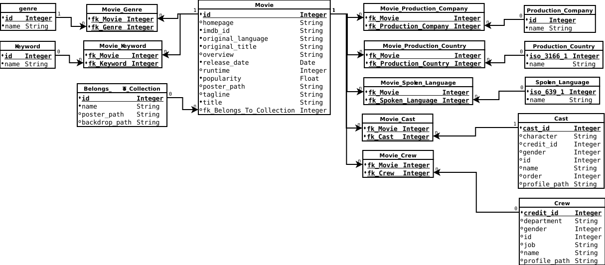

# Business Overview

## Context
In a world... where movies made an estimated $41.7 billion in 2018, the film industry is more popular than ever. For some movies, it's "You had me at 'Hello.'" For others, the trailer falls short of expectations and you think "What we have here is a failure to communicate."

## Problem
With metadata on over 7,000 past films from [The Movie Database](https://www.themoviedb.org/), we have to predict their overall worldwide box office revenue.

## Objective
The objective is to determine:

- What movies make the most money at the box office?
- How much does a director matter?
- How much does the budget matter?

We have to determine the movie revenue (\$) in function of the budget (\$) and in function of if the movie had a director as a member of the crew when they made it. Then, we have to identify let's say a top 10 in descending order of the predicted movie revenues.


# Dataset Information
The train and test datasets come from the Kaggle competition [TMDB Box Office Prediction](https://www.kaggle.com/c/tmdb-box-office-prediction/data). The objective is to know from the train dataset:

- The column names
- The number of columns
- The number of rows
- The number of values that are `NA` and empty 

Knowing this information gives hints on how to analyse the data and how the features could be correlated. If there are any NA or empty values, we have to understand the meaning of NA and empty in their context. This holds also for budgets of 0$.

## General Information
```{r echo = TRUE, message = FALSE, warning = FALSE, comment=NA}
source("DatasetInformation.R")
source("DataPreparation.R")
source("DataTransformation.R")

train <- read.csv("Dataset/train.csv", 
                  header = TRUE, 
                  stringsAsFactors = FALSE)

test <- read.csv("Dataset/test.csv", 
                  header = TRUE, 
                  stringsAsFactors = FALSE)

set.seed(1234)

## Remove scientific notation (e.g. E-005).
options(scipen = 999)

PrintDatasetInformation(train)
PrintDatasetInformation(test)
```

Here is the relational model of the dataset that is described in more details in sub-sections below.
```{r pressure, echo=FALSE, out.width = '100%'}

```


## Possible Algorithms
We know that the objective is to predict the revenue of every movie in the test dataset. We also know that:

- The output is the revenue of every movie.
- The output is a real number.
- The accuracy of the prediction is important over the speed (which should not be neglected)

Therefore, we need algorithms in the supervised learning and regression category. In this analysis, we consider 2 algorithms considering that the speed has to be not neglected:

- Random Forest
- Extreme Gradient Boosting Trees


## Code Book

### Movie Collection Information
The feature `Belongs_to_collection` contains the following properties as a JSON array:

- id: The movie collection ID (Integer)
- name: The movie collection name (string)
- poster_path: The movie collection poster image path(string)
- backdrop_path: The movie collection backdrop path (string)

The value of this feature is empty if the movie is not in a collection (e.g.The movie collection Back to the future 1, 2, and 3). We deduce that:

- A movie is in its own collection if and only if the feature `belongs_to_collection` is empty. 
- A movie cannot be in more than one collection.
- A collection may contain many movies.

### Movie Genres Information
The feature `genres` contains the following properties as a JSON array:

- id: The genre ID (integer)
- name: The name of the genre

According to the dataset, we deduced that:

- A movie can have one or many genres.
- A genre can contain one or many movies.
- A movie can have no genre meaning that it is not classified.

### Production Companies Information
The feature `production_companies` contains the following properties as a JSON array:

- iso_3166_1: The production company country abbreviation (e.g. US)
- name: The production company name

According to the dataset, we deduced that:

- A movie can be produced by one or many companies.
- A production company can have produced one or many movies.
- A movie that is not associated to at least one production company could be produced by amators or particular producer producing his own movies.

### Production Countries Information
The feature `production_countries` contains the following properties as a JSON array:

- iso_3166_1: The production country abbreviation (e.g. US) where the movie has been produced
- name: The production country name

According to the dataset, we deduced that:

- A movie can be produced in one or many countries.
- A production country can contain one or many movies.
- A movie that is not associated to at least one production country could be ???

### Spoken Languages Information
The feature `spoken_languages` contains the following properties as a JSON array:

- iso_639_1: The spoken language country abbreviation (e.g. US)
- name: The spoken language name (could contain non ascii characters)

According to the dataset, we deduced that:

- In a movie, one or many languages can be spoken.
- A spoken language can be used in one or many movies.
- A movie that is not associated to at least one spoken language could be silent movies like Charlie Chaplin or Mr. Bean.

### Keywords Information
The feature `Keywords` contains the following properties as a JSON array:

- id: The keyword ID (Integer)
- name: The keyword (String)

According to the dataset, we deduced that:

- One or many keywords can be used for a movie.
- One or many movies can be associated to a keyword.
- A movie that is not associated to at least one keyword could be ???.

### Cast Information
The feature `cast` contains the following properties as a JSON array:

- cast_id: The cast ID corresponding to one character playing in the movie.
- character: The character name in the movie (could be empty)
- credit_id: The credit ID as an hexadecimal string
- gender: The character is a female (1), a male (2) or other (0)
- id: The ID of the actor playing in the movie or of an event occuring in the movie
- name: The name of the actor playing in the movie or of the event occuring in the movie
- order: The order of displaying in the credit at the end of the movie
- profile_path: Avatar of the actor of the movie as an image path

Note that an actor can play in one or many movies and a cast can contain one or many actors.

### Crew Information
The feature `crew` contains the following properties as a JSON array:

- credit_id: The credit ID as an hexadecimal string representing a member of the crew
- department: Department name in which the member of the crew was working (e.g. Directing, Writing, Sound, etc.)
- gender: The member of the crew is a female (1), a male (2) or other (0)
- id: The ID of the member of the crew
- job: The job name of the member of the crew (e.g. Director, Producer, Writer, Screenplay, etc.)
- name: Name of the member of the crew
- profile_path: Profile image path of the member of the crew

Note that a member of the crew can be hired to help making one or many movies and a movie can contain one or many members of the crew.


# Data Preparation
The objective of preparing the data is to clean the dataset and make the dataset workable in order to visualize the data. Preparing the dataset is represented by the following steps:

1. Detect and fix values that seem to be wrong in their context.
2. Replace the NA or empty values in the dataset by meaningful values.
3. Determine and remove columns that will not help us on the visualisation of data.
4. Add new features from existing ones.

## JSON Standard Validation
The objective is to detect features that contain invalid keys and/or values and fix them with valid values without modifying the context of the data.

If we take a closer look to the JSON strings, we notice that their keys and values of type string are all surrounded by single quotes. Here is an example taken from the first observation of the feature `belongs_to_collection`:
`[{'id': 313576, 'name': 'Hot Tub Time Machine Collection', 'poster_path': '/iEhb00TGPucF0b4joM1ieyY026U.jpg', 'backdrop_path': '/noeTVcgpBiD48fDjFVic1Vz7ope.jpg'}]`.
This is not respecting the [JSON standard](https://www.json.org/) which requires double quotes for string values. The library `jsonlite` is validating this standard and we get a validation error. In order to fix that, we have to replace all single quotes in all JSON strings of the dataset by double quotes. However, we have to assume that there may have single or double quotes in the string value itself. 

Here is a list of syntax rules that we verify:

1. All keys have to be surrounded by double quotes `"` followed by a colon `:`, a space and its mapped value (e.g. `"id": 1`).
2. All string values have to be surrounded by double quotes `"` (e.g. `"string value"`).
3. Special characters like double quotes ("), backslashes `\` and squares `#` must not be used.
4. The value `None` (e.g. `"backdrop_path": None`), `[]`, `N/A` or empty must not be used as a value. The value `null` has to be used instead.
5. Each element of an array has to start with a bracket `{` followed by a double quote `"` (e.g. `{"id"`).
6. Each element of an array has to end with a bracket `}` (e.g. `"name": "Comedy"}`).
7. Each mapping (key, value) has to be separated by a comma `,` (e.g. `"id": 18, "name": "Drama"` or `"name": null, "id": 2` or `"name": "US", "id": 1`).

For example, there are some actors having a nickname in their character name in the cast. Those are written between double quotes (e.g. in the cast of Rocky Balboa: `'cast_id': 17, 'character': 'Adrianna "Adrian" Pennino'`). Because of such a case, we have to replace all double quotes by single quotes on first step.

```{r echo = TRUE, message = FALSE, warning = FALSE, comment=NA}
## The feature Keywords is the only one whose name is starting with an uppercase.
## To be coherent with all of the other features name, it should starts with a lowercase.
colnames(train)[which(names(train) == "Keywords")] <- "keywords"
colnames(test)[which(names(test) == "Keywords")] <- "keywords"

features_to_fix <- c("belongs_to_collection", "genres", "production_companies", "production_countries", "spoken_languages", "keywords", "cast", "crew")
for(feature_to_fix in features_to_fix)
{
    train[, feature_to_fix] <- FixJSONStandardErrors(train[, feature_to_fix])
    test[, feature_to_fix] <- FixJSONStandardErrors(test[, feature_to_fix])
}
```


## Incorrect Values 
An incorrect value is a value that is invalid in the feature context. For example, the feature `crew` having an observation that gives the keywords instead or the crew. It can be seen as a misplaced value. We also validate the coherence between observations of a same feature. It could occur that for the feature `genres` that all observations except one start with the `id` whereas one of them starts with `name` instead. This is an incoherence between this observation and the others.

Since there are too many error possibilities, we establish the following rules for every observation in every feature containing JSON strings:

- The JSON string in the feature `belongs_to_collection` has to start with the property `id` like `[{"id":` *or* be empty.
- The JSON string in the feature `genres` has to start with the property `id` like `[{"id":` *or* be empty.
- The JSON string in the feature `production_companies` has to start with the property `name` like `[{"name":` *or* be empty.
- The JSON string in the feature `production_countries` has to start with the property `iso_3166_1` like `[{"iso_3166_1":` *or* be empty.
- The JSON string in the feature `spoken_languages` has to start with the property `iso_639_1` like `[{"iso_639_1":` *or* be empty.
- The JSON string in the feature `keywords` has to start with the property `id` like `[{"id":` *or* be empty.
- The JSON string in the feature `cast` has to start with the property `cast_id` like `[{"cast_id":` *or* be empty.
- The JSON string in the feature `crew` has to start with the property `credit_id` like `[{"credit_id":` *or* be empty.

```{r echo = TRUE, message = FALSE, warning = FALSE, comment=NA}
features_to_validate <- list(belongs_to_collection = "id",
                             genres = "id",
                             production_companies = "name", 
                             production_countries = "iso_3166_1", 
                             spoken_languages = "iso_639_1", 
                             keywords = "id", 
                             cast = "cast_id", 
                             crew = "credit_id")

PrintNumberOfInvalidValuesDetected(train, features_to_validate)
PrintNumberOfInvalidValuesDetected(test, features_to_validate)
```


## NA Values
The only feature containing `NA` in the train dataset is the movie runtime (6 movies among 7398). We consider the value `0` the same as the `NA` value because having a movie runtime of 0 minutes is impossible. We get the 2 movies from the train dataset where their runtime is `NA` and then we replace their value by a valid one taken from another source (e.g. IMDB).

```{r echo = TRUE, message = FALSE, warning = FALSE, comment=NA}
print(train[is.na(train$runtime), c("id", "title", "release_date", "runtime")])

## Source: https://www.imdb.com/title/tt1107828/
train[train$id == 1336, "runtime"] <- 130

## Source: https://www.german-films.de/filmarchive/browse-archive/view/detail/film/happy-weekend/index.html
train[train$id == 2303, "runtime"] <- 94

print(test[is.na(test$runtime), c("id", "title", "release_date", "runtime")])

## Source: https://www.imdb.com/title/tt0082131/ 
test[test$id == 3244, "runtime"] <- 93

## Source: https://www.imdb.com/title/tt3132094/ 
test[test$id == 4490, "runtime"] <- 91

## Source: https://www.filmaffinity.com/es/film267495.html 
test[test$id == 4633, "runtime"] <- 100

## Source: https://www.imdb.com/title/tt2192844/ 
test[test$id == 6818, "runtime"] <- 90
```


## Empty Values
Many of the features having at least one empty value are explained the following ways:

- `belongs_to_collection`: The movie does not belong to a collection of movies.
- `homepage`: The movie does not have a homapage.
- `poster_path`: The movie does not have a film poster. We assume that either the movie has a very low budget and get low revenue or they do not have this information or oversight the poster when inserting the movie in the database.
- `overview`: The movie does not have an overview. We assume that the movie is not enough popular to take the time to give an overview of the movie or it could be an oversight.
- `spoken_languages`: The movie could be a silent movie like Charlie Chaplin or Mr. Bean.
- `production_companies`: A movie self-made could be the reason why a movie does not use a production company.
- `tagline`: The does not have a tagline. We assume that a movie with a great tagline is a movie that we remember. We expect that the movie popularity will be higher. Movie without taglines are less popular and then the revenue could be lower.
- `Keywords`: No keywords describe the movie. 
- `genres`: We assume that a movie not associated to genres is non classifed. 
- `title`: The empty movie title could be an oversight because the original title is taken instead in some rare cases.

We assume that the empty values in the following features are oversights in the database or they just do not have the information on them:

- `production_countries`: It is impossible that a movie is produced nowhere. It could be possible that there is no information found about the production country.
- `crew`: It is impossible that a movie has been made by itself. It has to have at least one member of the crew like the producer.
- `status`: There are 7396 / 7398 movies that are relased. The 2 other movies do not have a status. In this case, we assume that they are released.
- `release_date`: There are 7397 / 7398 movies that have a release date. 

We have to replace this empty date by a real date because we extract the year, month and weekday in the data visualisation and transformation section. However, we need to predict a release date in function of other features in order to estimate the correct date. Instead of predicting these dates, we set the release date to Junuary 1st, 1920. The movies will be grouped by this date.
```{r echo = TRUE, message = FALSE, warning = FALSE, comment=NA}
test$release_date[test$release_date == ""] <- "1/1/20"
```


## Useless Features
The objective is to remove features assuming that they will not be useful for the prediction.

The first one is the movie `status` because all movies in both dataset are released (except 2 of them that we assumed to be released).
```{r echo = TRUE, message = FALSE, warning = FALSE, comment=NA}
train$status <- NULL
test$status <- NULL
```

The `imdb_id` and `poster_path` are also useless because they do not give any useful information on the movie revenue.
```{r echo = TRUE, message = FALSE, warning = FALSE, comment=NA}
train$imdb_id <- NULL
train$poster_path <- NULL

test$imdb_id <- NULL
test$poster_path <- NULL
```

Since there are only 8 movies having no overview in the dataset, it is useless to see what is the revenue in function of if the movie has or not an overview. The same logic applies to the `original_title` and `title` features.
```{r echo = TRUE, message = FALSE, warning = FALSE, comment=NA}
train$overview <- NULL
train$original_title <- NULL

test$overview <- NULL
test$original_title <- NULL
```

Since we want to know which production companies have made the best movies revenue, it becomes usaless to keep the production countries.
```{r echo = TRUE, message = FALSE, warning = FALSE, comment=NA}
train$production_countries <- NULL
test$production_countries <- NULL
```

We keep the `title` only for this section for informational purposes. It will be removed at the end of this section.


# Data Visualization and Transformation
The first objective is to verify if we reject or not our assumptions by visualizing the data using scatter plots or bar charts. This will help us to know which features are helpful or useless on the predictions.

The second objective is to transform the train dataset in order to obtain a matrix of real and integer values for the predictions purposes. Each time the conclusion according to their chart will show that the feature has a significant impact on the movie revenue, the string (including the ones containing JSON) feature is transformed to a numeric feature.


## Movie Collection
The objective is to know if the income of a movie belonging in a collection is higher than a movie that is not in a collection. A movie that belongs in a collection could mean that:

- the movie was enough good to gain a large revenue that the producer(s) decided to make a second movie and so on as a series.
- the same or another producer decided to do a remake of the movie many years after the original one (e.g. Karate kid, Superman).

For both assumptions, we expect a greater revenue for movies in a collection.

```{r echo = TRUE, message = FALSE, warning = FALSE, comment=NA}
train$is_in_collection <- unlist(lapply(train$belongs_to_collection, function(collection) CountJSONArrayInFeature(collection)))
train$belongs_to_collection <- NULL

test$is_in_collection <- unlist(lapply(test$belongs_to_collection, function(collection) CountJSONArrayInFeature(collection)))
test$belongs_to_collection <- NULL
```

We build a bar chart to represent the revenue average in function of if the movie is in a collection or not.
```{r echo = TRUE, message = FALSE, warning = FALSE, comment=NA}
library(ggplot2)
library(dplyr)

train %>%
    group_by(is_in_collection) %>% 
    summarise(mean = mean(revenue)) %>%
    ggplot(aes(x = is_in_collection, y = mean)) +
          geom_bar(stat = "identity") + 
          ggtitle("Average revenue in function of if the movie is in a collection or not") +
          labs(x = "In a collection", y = "Average Revenue")
```

There is a significant difference where the revenue of movies in a collection is much greater than the ones not in a collection. 


## Movie Keywords
From the feature `keywords`, we only need to know the number of keywords used in order to facilitate the search of the movie. We assume that a movie associated to many keywords could help increasing its revenue because it is easier to search and find. However, it may also depend on the language the keywords are because in a foreign language it could be harder to know the spelling of the keyword and then to search with it. It depends also on the precision of the keywords. For example, the movie `Casino Royale` keywords `James Bond`, `007`, `Digit` and `casino` are more precise than `bank`, `money` and `terrorist`.
```{r echo = TRUE, message = FALSE, warning = FALSE, comment=NA}
train$number_of_keywords <- unlist(lapply(train$keywords, function(keywords) CountJSONArrayInFeature(keywords)))
train$keywords <- NULL

test$number_of_keywords <- unlist(lapply(test$keywords, function(keywords) CountJSONArrayInFeature(keywords)))
test$keywords <- NULL
```

We build a scatter plot to represent the average revenue in function of the number of keywords.
```{r echo = TRUE, message = FALSE, warning = FALSE, comment=NA}
train %>%
    group_by(number_of_keywords) %>% 
    summarise(mean = mean(revenue)) %>%
    ggplot(aes(x = number_of_keywords, y = mean)) +
           geom_point() + 
           geom_smooth(method = lm) +
           ggtitle("Average revenue in function of the number of keywords") +
           labs(x = "Number of Keywords", y = "Average Revenue")
```


## Director(s) As Member of the Crew
From the feature `crew`, we want to know if having a director as a member of the crew has significant impacts on the movie revenue. The director has the role to choose the cast and crew members, they have to be creative in order to ensure the movie is realized within the budget. However, the director depends on the budget to make the movie and also on his competences.
```{r echo = TRUE, message = FALSE, warning = FALSE, comment=NA}
train$has_directors <- unlist(lapply(train$crew, function(crew) ifelse(CountDirectorsInCrew(crew) > 0, 1, 0)))
train$crew <- NULL

test$has_directors <- unlist(lapply(test$crew, function(crew) ifelse(CountDirectorsInCrew(crew) > 0, 1, 0)))
test$crew <- NULL
```

We build a bar chart in order to represent the average revenue in function of the number of directors.
```{r echo = TRUE, message = FALSE, warning = FALSE, comment=NA}
train %>%
    group_by(has_directors) %>% 
    summarise(mean = mean(revenue)) %>%
    ggplot(aes(x = factor(has_directors), y = mean)) +
          geom_bar(stat = "identity") + 
          ggtitle("Average revenue in function of if there is at least a director or not") +
          labs(x = "Has Director", y = "Average Revenue") +
          scale_x_discrete(labels = c("No", "Yes"))
```

According to this bar chart, having directors in the crew have significant negative impacts on the revenue of the movie. It may be caused by a selection of inexperienced member of the crew or actors. It may also be caused by the downfall of the director who was too confident because he did a good movie once. Many reasons can explain this negative impact.


## Movie Casting
For the feature `cast`, we know that more characters are playing in a movie, more large must be the budget. This is also based on the popularity of the actors and how much they ask to play in the movie. We assume that most of the time, the revenue is increasing as the number of actors increases.
```{r echo = TRUE, message = FALSE, warning = FALSE, comment=NA}
train$number_of_characters <- unlist(lapply(train$cast, CountJSONArrayInFeature))
train$cast <- NULL

test$number_of_characters <- unlist(lapply(test$cast, CountJSONArrayInFeature))
test$cast <- NULL
```

We build a scatter plot to represent the average revenue in function of the number of characters playing in the movie.
```{r echo = TRUE, message = FALSE, warning = FALSE, comment=NA}
train %>%
    group_by(number_of_characters) %>% 
    summarise(mean = mean(revenue)) %>%
    ggplot(aes(x = number_of_characters, y = mean)) +
           geom_point() + 
           geom_smooth(method = lm) +
           ggtitle("Average revenue in function of the number of characters") +
           labs(x = "Number of Characters", y = "Average Revenue")
```

We have to consider the budget allowed because it is possible that many actors play in a low budget movie. These actors are paid with a lower salary or they are inexperienced which could justify their low salary. Another reason could be that many of these actors are playing a very short among of time in the movie. This may explain why sometimes with many characters the revenue is still low.


## Movie Genres
Nowadays, superheros movies (e.g. Avengers, Superman, Iron man, etc.) or action/adventure movies are really popular and their incomes are huge. These movies are generally classified as science-fiction, action, adventure and fantasy. We assume that those genres of movies generate more revenue than the others. The objective is to visualize the average revenue and popularity for every genre. Here are the steps to achieve the objective:

1. Extract in a data frame the genre names for every movie in the dataset with the movie ID, popularity and revenue.
2. Append this data frame to the one containing all movies.
3. Group the data frame by genre where we keep the average revenue and popularity.
4. Show a bar chart of the average revenue in function of the genre.
5. Keep the genre with the best revenue average if a movie is associated to many genres.

```{r echo = TRUE, message = FALSE, warning = FALSE, comment=NA}
## Steps 1 and 2: Append the data extracted.
movies.genres <- AppendExtractedData(train, "genres", subfeatures.to_exclude = "id")

## Step 3: Grouping the data and getting the means.
movies.genres <- movies.genres %>%
    group_by(name) %>%
    summarise(mean_revenue = mean(revenue))
movies.genres$id <- seq(1, nrow(movies.genres))

## Step 4: Bar chart of the average revenue based on the genre.
movies.genres %>%
    ggplot(aes(x = name, y = mean_revenue)) +
          geom_bar(stat = "identity") + 
          ggtitle("Average revenue in function of the genre name") +
          labs(x = "Genre Name", y = "Average Revenue") + 
          theme(axis.text.x = element_text(angle = 90, hjust = 1, vjust = 0.5))
```

According to these bar charts, both of them show that the following genres generate the highest revenue:

- Adventure
- Science-Fiction
- Fantasy
- Action
- Family
- Animation

And the ones generating the lowest revenue:

- Foreign
- Documentary
- TV Movies
- History

```{r echo = TRUE, message = FALSE, warning = FALSE, comment=NA}
## Step 5: Keep the genre with the best revenue average if a movie is associated to many genres.
print(movies.genres)

train$best_genre <- ExtractBestRevenueFromGenres(train, movies.genres)
train$genres <- NULL
head(train$best_genre, 10)

test$best_genre <- ExtractBestRevenueFromGenres(test, movies.genres)
movies.genres <- NULL
test$genres <- NULL
```


## Spoken Languages
One can assume that movies in which actors speaks in English have the best revenue because it is a well-known language around the world. However, if a spoken language (e.g. Sinhalese) is used in only one movie and another spoken language is used in this movie (e.g. English) where the revenue is huge, the average revenue associated to the Sinhalese spoken language will be huge. In such case, the results could be biaised and mislead to predict the revenue.

The objective is to visualize the average revenue for every spoken language. Here are the steps to achieve the objective:

1. Extract in a data frame the spoken language IDs `iso_639_1` for every movie in the dataset with the movie ID, popularity and revenue.
2. Append this data frame to the one containing all movies.
3. Group the data frame by spoken language where we keep the average revenue.
4. Show a bar chart of the average revenue in function of the spoken language.
5. Show a bar chart of the number of movies in function of the spoken language.

```{r echo = TRUE, message = FALSE, warning = FALSE, comment=NA}
## Steps 1 and 2: Append the extracted data.
movies.spoken_languages <- AppendExtractedData(train, "spoken_languages", subfeatures.to_exclude = "name")

## Step 3: Grouping the data and getting the mean and number of movies.
movies.spoken_languages <- movies.spoken_languages %>%
    group_by(iso_639_1) %>%
    summarise(mean_revenue = mean(revenue),
              number_of_movies = n())

## Step 4: Bar chart of the average revenue based on the spoken language.
movies.spoken_languages %>%
    ggplot(aes(x = iso_639_1, y = mean_revenue)) +
          geom_bar(stat = "identity") +
          ggtitle("Average revenue in function of the spoken language") +
          labs(x = "Spoken Language", y = "Average Revenue") +
          theme(axis.text.x = element_text(angle = 90, hjust = 1, vjust = 0.5))

## Step 5: Bar chart of the number of movies based on the spoken language.
movies.spoken_languages %>%
    ggplot(aes(x = iso_639_1, y = number_of_movies)) +
          geom_bar(stat = "identity") +
          ggtitle("Number of movies in function of the spoken language") +
          labs(x = "Spoken Language", y = "Number of Movies") +
          theme(axis.text.x = element_text(angle = 90, hjust = 1, vjust = 0.5))

movies.spoken_languages <- NULL
train$spoken_languages <- NULL
test$spoken_languages <- NULL
```

We see that the English spoken language represents `r round(movies.spoken_languages$number_of_movies[movies.spoken_languages$iso_639_1 == "en"] / nrow(train) * 100, 2)` % of the movies in this dataset. For the reasons we mentioned, we will not consider this feature to help calculating the predictions of the revenue.


## Movie Popularity
The popularity is a value that gets updated daily and takes a number of things into account like views, number of user ratings/watchlist/favourite additions and release date (Source: https://www.themoviedb.org/talk/56e614a2c3a3685aa4008121). 

One can assume that more a movie is popular, more its revenue is greater. However, a movie could be viewed by a large number of people where most of them do not like the movie enough to pay to see it. People could add the movie in the watchlist and never watch it. If we go further, a movie could be very popular because of its great trailer or ads. What if the trailer contains the best parts of the movie just to attract as many people as possible? When people will watch it, they will be dissapointed because they were expecting much more of the movie. In conclusion, we assume that the popularity could be misleading on the prediction of the revenue of a movie.

We build a scatter plot to represent the revenue in function of the popularity.
```{r echo = TRUE, message = FALSE, warning = FALSE, comment=NA}
train %>%
    ggplot(aes(x = popularity, y = revenue)) +
           geom_point() + 
           ggtitle("Movie revenue in function of the popularity") +
           labs(x = "Popularity", y = "Revenue")
```

According to this scatter plot, we see some movies where their popularity is greater than 100 with a revenue less than the revenue of some movies having their popularity less than 50. Let's see a top 10 of movies with the greatest revenue and their popularity.
```{r echo = TRUE, message = FALSE, warning = FALSE, comment=NA}
head(train[order(train$revenue, decreasing = TRUE), c("title", "popularity", "revenue")], n = 10)
```

As our assumption stated, the popularity could be misleading on the prediction of the revenue. A good example of this is the movie _Beauty and the Beast_ with a revenue of `r max(train$revenue[train$title == "Beauty and the Beast"])` (ranked 4th among the 3000 movies) and a great popularity of `r max(train$popularity[train$title == "Beauty and the Beast"])` whereas the movie _Transformers: Dark of the Moon_ generated a revenue of `r train$revenue[train$title == "Transformers: Dark of the Moon"]` (ranked 5th among the 3000 movies) and has a low popularity of `r train$popularity[train$title == "Transformers: Dark of the Moon"]`. 


## Movie Runtime
Generally, a movie should not be too long or too short. A too long movie may become boring or make people watching the movie in 2 parts or more because it takes too much time in a day to watch the full movie. For too short movies, the story could be shorten where there is no conclusion, skip some part of the story or not long enough because the movie is so good. For both cases, we expect that the imapcts on the revenue is negative.

```{r echo = TRUE, message = FALSE, warning = FALSE, comment=NA}
train %>%
    ggplot(aes(x = runtime, y = revenue)) +
           geom_point() + 
           ggtitle("Movie revenue in function of the runtime") +
           labs(x = "Runtime", y = "Revenue")
```

According to this scatter plot, runtimes between 90 minutes and 180 minutes obtain better revenue. Out of that range, the revenue is lower.


## Movie Homepage
Homepage for movies makes them more visible and accessible to people because they can get more details (news, new movies coming up, critics, trailers) on movies and get an overview of the list of movies (e.g. Marvel's movies). This is a good way to attract people and make them watch the movies. For example, if someone wants to see what Disney's movies are coming up soon, he search for Disney's movies and will quickly find the Disney's website. 

```{r echo = TRUE, message = FALSE, warning = FALSE, comment=NA}
train$has_homepage <- unlist(lapply(train$homepage, function(homepage) ifelse(homepage == "", 0, 1)))
train$homepage <- NULL

test$has_homepage <- unlist(lapply(test$homepage, function(homepage) ifelse(homepage == "", 0, 1)))
test$homepage <- NULL

train %>%
    group_by(has_homepage) %>%
    summarise(mean_revenue = mean(revenue)) %>%
    ggplot(aes(x = factor(has_homepage), y = mean_revenue)) +
          geom_bar(stat = "identity") +
          ggtitle("Average revenue in function of if the movie has or not a homepage") +
          labs(x = "Has a Homepage", y = "Average Revenue") +
          scale_x_discrete(labels = c("No", "Yes"))
```

According to this bar chart, the revenue is considerably greater for movies having a homepage than the ones that do not.


## Movie Original Language
We know that some languages are more spoken around the world than others. One can assume that English language spoken in movies is the most popular and has the best revenue average because it is a well-know language around the world. Movies where the actors speaks foreign languages that are spoken in only a country or in a part of a country will need to be translated and may not be known. We expect that this has a negative impact on the revenue.

However, we saw many good Chinese movies (specially with martial arts) with great Chinese actors (e.g. Jackie Chan, Donnie Yen, Jet Li) that got known around the world. Knowing that, we assume that Chinese movies have generated among the best revenue.

```{r echo = TRUE, message = FALSE, warning = FALSE, comment=NA}
original_languages.names <- unique(train$original_language)
original_languages <- data.frame(id = seq(1, length(original_languages.names)),
                                 name = original_languages.names)
train$original_language <- unlist(lapply(train$original_language, function(name) original_languages$id[original_languages$name == name]))

test.original_languages.names <- unique(test$original_language)
test.original_languages <- data.frame(id = seq(1, length(test.original_languages.names)),
                                 name = test.original_languages.names)
test$original_language <- unlist(lapply(test$original_language, function(name) test.original_languages$id[test.original_languages$name == name]))

train %>%
    group_by(original_language) %>%
    summarise(mean_revenue = mean(revenue)) %>%
    ggplot(aes(x = factor(original_language), y = mean_revenue)) +
          geom_bar(stat = "identity") +
          ggtitle("Average revenue in function of the original language") +
          labs(x = "Original Language", y = "Average Revenue") +
          scale_x_discrete(labels = original_languages$name)

original_languages <- NULL
original_languages.names <- NULL
```

As we expected, English and Chinese movies have generated the greatest average revenue. 


## Movie Budget
The budget is always an important constraint to consider before making a movie. If the budget allowed is low, we expect that the revenue will be also low but most of the time, it is much greater than the budget. 

```{r echo = TRUE, message = FALSE, warning = FALSE, comment=NA}
train %>%
    filter(budget > 0) %>%
    ggplot(aes(x = budget, y = revenue)) +
           geom_point() + 
           geom_smooth(method = lm) +
           ggtitle("Movie revenue in function of the budget") +
           labs(x = "Budget", y = "Revenue")
```

Our assumptions holds most of the time and the scatter plot describes a linear increasing of the revenue in function of the budget. Therefore, the budget matters and has impact on the movie revenue.


## Movie Tagline
A movie having a tagline can help the people remembering that movie because they are catchy and help selling the movie on a marketing point of view. Thus, we assume that movies having no tagline have their average revenue lower than the ones having a tagline.

```{r echo = TRUE, message = FALSE, warning = FALSE, comment=NA}
train$has_tagline <- unlist(lapply(train$tagline, function(tagline) ifelse(tagline == "", 0, 1)))
train$tagline <- NULL

test$has_tagline <- unlist(lapply(test$tagline, function(tagline) ifelse(tagline == "", 0, 1)))
test$tagline <- NULL

train %>%
    group_by(has_tagline) %>%
    summarise(mean_revenue = mean(revenue)) %>%
    ggplot(aes(x = factor(has_tagline), y = mean_revenue)) +
          geom_bar(stat = "identity") +
          ggtitle("Average revenue in function of if the movie has or not a tagline") +
          labs(x = "Has a Tagline", y = "Average Revenue") +
          scale_x_discrete(labels = c("No", "Yes"))
```

According to this bar chart, our assumption holds.


## Release Date
We know that making million or billion dollars was harder as we get back over the years because mainly of the inflation and life cost. Therefore, it makes sense that the revenue was considerably lower in the '80s and older than nowadays. We expect that the revenue will be much lower in the '50s, '60's until the '90s than the 2000s and 2010s.

We assume also that a movie released on the weekend (mainly Friday or Saturday) generates more revenue because people are generally not working the next day. They will see the movie in the evening but we cannot check that assumption because the time is not provided in this dataset.

Another assumption is that releasing a movie on Summer generates more revenue because young students going to high school or primary school can see the movie anytime during the daylight. Indeed, the school normally ends at the middle/end of June and starts on end of August or beginning of September.

The objective is to determine if the year, month or/and weekday the movie was released have a considerable impact on the revenue. Here are the steps to achieve this objective:

1. Convert the release date from string to date with a more lisible format `YYYY-MM-DD`.
2. Extract the year, month and weekday in a data frame for every movie release date.
3. Show bar charts of the revenue in function of the release year, release month and release week-day.

```{r echo = TRUE, message = FALSE, warning = FALSE, comment=NA}
## Step 1: Convert the release date from string to date with a more lisible format YYYY-MM-DD.
train$release_date <- as.Date(train$release_date, format = "%m/%d/%y")
test$release_date <- as.Date(test$release_date, format = "%m/%d/%y")

## Step 2: Extract the year, month and weekday in a data frame for every movie release date.
library(lubridate)

train$release_year <- year(train$release_date)
train$release_year[train$release_year > 2019] <- train$release_year[train$release_year > 2019] - 100
train$release_month <- month(train$release_date)
train$release_weekday <- wday(train$release_date)
train$release_date <- NULL

test$release_year <- year(test$release_date)
test$release_year[test$release_year > 2019] <- test$release_year[test$release_year > 2019] - 100
test$release_month <- month(test$release_date)
test$release_weekday <- wday(test$release_date)
test$release_date <- NULL

## Step 3: Show bar charts of the revenue in function of the release year, release month and release week-day.
train %>%
    group_by(release_year) %>%
    summarise(mean_revenue = mean(revenue)) %>%
    ggplot(aes(x = release_year, y = mean_revenue)) +
          geom_bar(stat = "identity") +
          ggtitle("Average revenue in function of its release year") +
          labs(x = "Release Year", y = "Average Revenue") +
          theme(axis.text.x = element_text(angle = 90, hjust = 1, vjust = 0.5))

train %>%
    group_by(release_month) %>%
    summarise(mean_revenue = mean(revenue)) %>%
    ggplot(aes(x = factor(release_month), y = mean_revenue)) +
          geom_bar(stat = "identity") +
          ggtitle("Average revenue in function of its release month") +
          labs(x = "Release Month", y = "Average Revenue") +
          scale_x_discrete(labels = c("January", "February", "March", "April", "May", "June", "July", "August", "September", "October", "November", "December")) +
          theme(axis.text.x = element_text(angle = 90, hjust = 1, vjust = 0.5))

train %>%
    group_by(release_weekday) %>%
    summarise(mean_revenue = mean(revenue)) %>%
    ggplot(aes(x = factor(release_weekday), y = mean_revenue)) +
          geom_bar(stat = "identity") +
          ggtitle("Average revenue in function of its release weekday") +
          labs(x = "Release Weekday", y = "Average Revenue") +
          scale_x_discrete(labels = c("Sunday", "Monday", "Tuesday", "Wednesday", "Thursday", "Friday", "Saturday")) +
          theme(axis.text.x = element_text(angle = 90, hjust = 1, vjust = 0.5))
```

According to these bar charts, we see that:

- Generally, more recent are the released movies, better are the revenue specially the last year (2017).
- Months of May, June and July got better revenue (specially June) which may be caused by the summer time as our assumption states.
- In December, the revenue is also great probably because of Christmas where children are on holiday vacations the last part of the month.
- Movies relased on Wednesday got better revenue followed by Thuesday. This is suprising because it is in the middle of the week.


## Production Companies
A production company is generally the one that sets the budget of a movie and makes decisions on hiring directors, actors and writters (crew and casting). Production companies can team up together to work on bigger movies involving many great actors. Thus, we expect that making a movie without a production company will generate a very low revenue. For companies teaming up with others contribute on the budget. Some well-known production companies are known to produce great movies. For example, _Walt Disney Pictures_ is known for animated and family movies where The beauty and the beast got a great revenue. Others like _Marvel Studios_, _Warner Bros_, _Paramount Pictures_ and _Twentieth Century Fox Film Corporation_ are also well-known and generated great movies as well. 

In this dataset, we see that a movie can have been made by many production companies. In this case, each of them could have contributed on the budget. However, the contribution for each of them is not known. We only know the budget allowed to make the movie. We could divide the budget by the number of production companies involved but we assume that this will not be accurate. 

We have to be careful about the budget because some companies like _Film It Suda_ has a budget of 4 but a revenue of 24270441 which is completly absurd. Also, we could consider only the number of movies made by a production company to sort the companies from the most important to the less important. Here again, what if a company is new (made its first movie), invested a high percentage of the budget and this movie generated among the best revenue? In such case, considering only the number of movies is not sufficient. 

The objective is to determine which production companies made the best revenue in function of the budget and the number of movies. As we saw in the analysis of the budget, in general, the revenue increases as the budget increases.


In order to obtain the ranking of the production companies, we use the score function defined as:
$$S(\bar{b}, n_m) = \frac{\bar{b} n_m}{n_t}$$
where

- $n_m$ is the number of movies made per production company and $n_m > 0$ is an integer.
- $\bar{b}$ is the average budget allowed per production company and $\bar{b} \geq 0$ is a real number.
- $n_t$ is the number of movies in the train dataset and $n_t > 0$ an integer.

The following steps have to be done in order to achieve the objective:

1. Extract in a data frame the production company names for every movie in the dataset with the movie ID, budget and revenue.
2. Append this data frame to the one containing all movies.
3. Group the data frame by production company name where we keep the average revenue, average budget and number of movies.
4. Calculate the score for every production company and add it to the data frame.
5. Keep the production company with the highest score for every movie of this dataset.
6. Show a bar chart of the average revenue in function of the production company.

```{r echo = TRUE, message = FALSE, warning = FALSE, comment=NA}
## Steps 1 and 2: Append the data extracted in a data frame.
train.production.companies <- AppendExtractedData(train, "production_companies")
test.production.companies <- AppendExtractedData(test, "production_companies")

## Steps 3 and 4: Grouping the data and getting the means and calculate the score for every production company and add it to the data frame.
train.production.companies <- GetScoreByProductionCompanyName(train, train.production.companies)
test.production.companies <- GetScoreByProductionCompanyName(test, test.production.companies)
print(train.production.companies, n = 25)

## Step 5: Keep the production company with the highest score for every movie of this dataset.
train.production.companies.best <- ExtractBestScoreFromProductionCompanies(train, train.production.companies)
test.production.companies.best <- ExtractBestScoreFromProductionCompanies(test, test.production.companies)

## The feature production_company_names is used only for the graph purposes.
train$production_company_scores <- train.production.companies.best
#train$production_company_names <- train.production.companies.best$name
train$production_companies <- NULL

test$production_company_scores <- test.production.companies.best
test$production_companies <- NULL

## Step 6: Show a bar chart of the average revenue in function of the production company.
train.production.companies %>%
    top_n(30) %>%
    ggplot(aes(x = name, y = mean_revenue)) +
           geom_bar(stat = "identity") +
           ggtitle("Average revenue in function of the production company") +
           labs(x = "Production Company", y = "Average Revenue") +
           theme(axis.text.x = element_text(angle = 90, hjust = 1, vjust = 0.5))

train.production.companies <- NULL
train.production.companies.best <- NULL
test.production.companies <- NULL
test.production.companies.best <- NULL

train$production_company_names <- NULL
train$title <- NULL
test$title <- NULL
```

According to the production company best score for every movie, `Marvel Studios`followed by `Revolution Sun Studios` and `DC Entertainment` are the top 3 production companies where their movies generated the best average revenue.


# Models
Now that we have observed how the movie revenue behave in function of our features, we start the prediction phase. This phase consists to create a model based on our train dataset in order to train our model and then apply it on the test dataset to obtain the predicted revenue. We know that regression algorithms are suitable for the problem we have to solve. Thus, we start with a linear regression model and then we compared with the Extreme gradient boosting trees and Random forest models.

Before starting to build a model from our train and test datasets, we need to define variables in order to prepare for the regression algorithms that will follow:

- $n_c \in \mathbb{N}_*$ be the number of features (columns) in the dataset.
- $n_r \in \mathbb{N}_*$ be the number of movies (rows) in the dataset.
- $X \in M_{n_r, n_c}(\mathbb{R}^+)$ be the matrix representing a dataset.
- $x_i (x_{i, 1}, x_{i, 2}, \ldots, x_{i, n_c})$ be the movie $i$ in the dataset $X$ where $x_i \in \mathbb{R}^{n_c}$.
- $y = (y_1, y_2, \ldots, y_{n_r})$ be the movie revenue to predict in the test dataset where every $y_i \in \mathbb{R}$.

In the train dataset, the number of features is $n_c = 15$ and the number of movies is $n_r = 3000$. The movie revenue known in the train set only is $y = (y_1, y_2, \ldots, y_{3000}) = (12314651, 95149435, 13092000, \ldots, 82087155)$. 

In order to obtain the movie revenue $Y$ in the test dataset, we need to apply on each movie $x_i$ a function $f$ such that $y_i = f(x_i) + \epsilon(x_i)$ or equivalently 
$$y_i - f(x_i) = \epsilon(x_i)$$ 
where $\epsilon(x_i)$ is the residuals function for $i = 1, 2, \ldots, 4398$. Note that $f(x_i)$ is our predictor function for the test dataset $X$ where $n_r = 4398$ and $n_c = 15$.


## Linear Regression Model
The objective is to build a linear regression model knowing how the features correlate together and which ones have the strongest correlation with the revenue. 

```{r echo = TRUE, message = FALSE, warning = FALSE, comment=NA}
train.correlation <- cor(train)

library(corrplot)
corrplot(train.correlation, method = "number", bg = "grey10",
         addgrid.col = "gray50", tl.cex=0.7, tl.col = "black", number.cex = 0.55,
         col = colorRampPalette(c("red", "green", "cyan"))(100))
```

We observe that the strongest correlation is between the budget ($x_1$) and the revenue ($y$) with $r(x_1, y) = 0.75$ which is good comparing to the other features. The second one is the popularity ($x_3$) with $r(x_3, y) = 0.46$.

Let's fit a linear regression equation $f(x_i) = \beta_0 + \beta_1 x_i$ to the points $(x_{1,1}, y_1), (x_{2,1}, y_2), \ldots, (x_{3000,1}, y_{3000})$ and get the equation coefficients $\beta_0, \beta_1 \in \mathbb{R}$.
```{r echo = TRUE, message = FALSE, warning = FALSE, comment=NA}
budget.fit <- lm(train$revenue ~ train$budget)
summary(budget.fit)
```

Using the estimated intercept value and the estimated budget coefficient, we found that the regression equation is
$$
f(x_i) = 3708754.79757 + 2.79686 x_i.
$$
The residuals are defined as $\epsilon_i = y_i - f(x_i)$ where $\epsilon_i \sim \mathcal{N}(0, 90520000)$. To calculate the residuals, we use the RMSLE (states for Root Mean Squared Log Error) function 
$$
RMSLE(y, f(X)) = \sqrt{\frac{1}{n_r} \sum_{i = 1}^{n_r} \left(\log(f(x_i) + 1) - \log(y_i + 1)\right)^2}.
$$
Then, we apply the RMSLE on our predicted revenues $f(X)$ and the revenues $y$ given in the train dataset.
```{r echo = TRUE, message = FALSE, warning = FALSE, comment=NA}
budget.fit.coefficients <- coef(budget.fit)
revenue.estimated <- budget.fit.coefficients["(Intercept)"] + budget.fit.coefficients["train$budget"] * train$budget

library(Metrics)
cat("RMSLE = ", rmsle(revenue.estimated, train$revenue), "\n\n")
```

This regression model penalizes outliers (points that are far from the linear model). Movies with low budget and generating big revenues are not following this linear model and then are penalized. The same applies with big budget allowed to movies that generated low revenues.

```{r echo = TRUE, message = FALSE, warning = FALSE, comment=NA}
train %>%
    filter(budget > 0) %>%
    ggplot(aes(x = budget, y = revenue)) +
           geom_point() + 
           geom_smooth(method = lm) +
           ggtitle("Movie revenue in function of the budget") +
           labs(x = "Budget", y = "Revenue")
```


## Extreme gradient Boosting Trees Model
The extreme gradient boosting trees model is part of an ensemble set of algorithms using the gradient descent to minimize the loss function and adjusting the residuals with weak learners (Boosting phase). For mathematical details about how the algorithm works, refer to [this article](https://homes.cs.washington.edu/~tqchen/pdf/BoostedTree.pdf).

The weak learners could be seen as humans pulling a huge structure. Having more humans to pull the heavy structure will increase the total strength and then the structure will move quicker. Of course some of these humans are stronger than others. This is the same for weak learners. In our case, the algorithm uses regression trees as weak learners. Some of these trees could be better depending on how they are built.


### Model Preparation Phase
The objective is to initialize the values of the parameters of the `xgboost` model and then find the optimal combination of them in order to minimize the loss function Root Mean Squared Log Error (RMSLE). Here is the list of parameters we know:

- `booster`: We will use the regression trees, hence `gbtree`.
- `objective`: The learning objective function representing the loss function to minimize. Since the RMSLE is used, we use the regression squared log loss function `reg:squaredlogerror`.
- `eval_metric`: The loss function used. In our case it is `rmsle`.

We have to determine the optimal value of the following parameters:

- `eta`: Step size shrinkage of new weights to help preventing overfitting 
- `gamma`: 
- `lambda`: L2 Regulation term on weights
- `subsample`:
- `colsample_bytree`: 
- `min_child_weight`:
- `num_round`: The number of regression trees
- `max_depth`: The maximum depth of the regression trees


### Cross Validation
The objective is to train our model on the train set using our optimal parameters and analyse where it predicts well versus where it does not predict correctly. According to that analysis, we will adjust the parameters and if necessary, add features that could help or remove features that are noise.


### Predictions
The objective is to apply our optimal model validated to our test set in order to get the predictions on the movies revenue in a CSV file.


## Random Forest Model


### Preparing Models


### Cross Validation


### Predictions


# Conclusion
